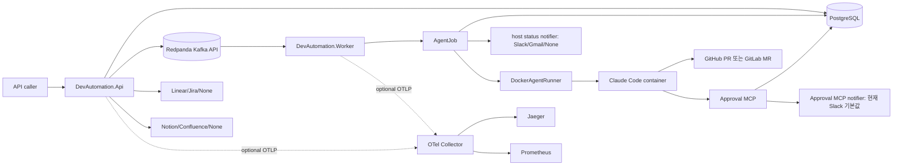

# 시스템 아키텍처와 진화 방향

> Notion canonical:
> [시스템 아키텍처와 진화 방향](https://app.notion.com/p/39cef22ad4fc81f298fec2e6c87b101d)
>
> 기준일: 2026-07-14

## 현재 토폴로지

## 컴포넌트 책임

<!-- markdownlint-disable MD013 -->
| 컴포넌트 | 책임 | 현재 경계 |
| --- | --- | --- |
| API | HTTP, health/readiness, Ticket 저장, Kafka publish, 승인·Slack callback | 인증/인가 없음 |
| Worker | Kafka consume, retry/DLQ, terminal-ticket idempotency, AgentJob | 별도 health endpoint 없음 |
| PostgreSQL | Ticket, ApprovalRequest, ExecutionLog의 system of record | DB와 Kafka publish는 비원자적 |
| Redpanda | 실행 신호와 DLQ | local Compose에서 비영속 |
| DockerAgentRunner | container, clone, branch, agent, push, PR/MR URL | host Docker socket 기반 local-only |
| Approval MCP | DB polling 기반 사람 승인 | agent container는 현재 Slack 기본값 |
| OTel profile | trace/metric local 조회 | alerting·backend persistence 없음 |
<!-- markdownlint-enable MD013 -->

## 의존 방향

`Api`, `Worker`, `ApprovalMcp`가 `Infrastructure`와 `Core`를 조합합니다.
`Core`는 도메인·계약·옵션을, `Infrastructure`는 EF/Kafka/Docker/provider 구현을
소유합니다.

## 핵심 실행 흐름

1. API가 선택적 readiness gate를 평가합니다.
2. `Ticket(Pending)`을 PostgreSQL에 저장합니다.
3. 선택적으로 Linear/Jira issue를 만들거나 기존 reference를 연결합니다.
   외부 issue 자체를 실행 입력으로 수신하는 grammar는 ZZA-53 backlog입니다.
4. Kafka topic에 ticket ID와 attempt metadata를 publish합니다.
5. Worker가 message를 consume하고 `AgentJob`을 실행합니다.
6. `AgentJob`은 terminal ticket replay를 no-op 처리하고, 그 외 ticket은 worker-side
   pre-run readiness gate를 다시 평가합니다. runnable이 아니면 `Running` 전이와
   container 생성 전에 `Failed`로 저장하고 알림을 보냅니다.
7. gate를 통과하면 `Running`으로 전이하고 host status notifier로 알립니다.
8. Docker agent가 repo를 clone하고 `agent/ticket-<id>` branch에서 작업합니다.
9. 필요한 경우 Approval MCP로 `WaitingApproval` 상태를 거칩니다.
10. 결과에 따라 Ticket을 `Completed` 또는 `Failed`로 전이하고 로그를 기록합니다.
    Agent가 URL을 반환한 경우에만 PR/MR URL도 저장합니다.
11. worker 처리 예외는 bounded retry 후 DLQ로 이동합니다.

## 신뢰와 데이터 경계

- 현재 HTTP API는 trusted single-user local development 전용입니다.
- Host publish port는 Compose에서 loopback으로 제한합니다. 전체 API를 proxy로
  공개하지 않습니다. Slack callback QA만 단일 path 제한 proxy를 사용합니다.
- API와 worker가 host Docker socket을 mount하므로 공유·production-like 환경에
  그대로 배포할 수 없습니다.
- host의 `AgentJob` status notifier는 `Slack/Gmail/None` 선택을 따릅니다. 이 경로는
  agent container 안의 Approval MCP egress와 별개입니다.
- agent container에는 선택된 coding/repository provider secret과 Approval MCP
  runtime 값만 allowlist로 전달합니다. 다만 host의 `Notifier:Provider`와 Gmail 설정은
  전달되지 않아 container의 Approval MCP는 현재 Slack 기본값을 사용합니다.
- secret redaction은 agent stream, readiness, Kafka failure payload 중심입니다.
  framework/provider/file log 전체를 보장하지 않습니다.
- PostgreSQL에는 named volume이 있지만 Redpanda에는 volume이 없습니다.
  `docker compose down` 후 DB row는 남고 queue/DLQ/offset은 사라질 수 있습니다.

## 완료와 다음 방향

완료:

- ZZA-59 API/Worker 분리
- ZZA-61 bounded retry/DLQ
- ZZA-62 local OTel profile
- ZZA-64 Docker socket/secret boundary hardening

다음:

1. API 인증/인가와 보호된 ingress
2. DB↔Kafka outbox/reconciler와 run replay
3. persistent broker와 DLQ replay 도구
4. ZZA-60 Langfuse AI trace
5. ZZA-63 LiteLLM compatibility spike
6. ZZA-53 Linear execution grammar
7. production-grade isolated runner

## 코드 근거

- `src/DevAutomation.Api/Program.cs`
- `src/DevAutomation.Worker/Program.cs`
- `src/DevAutomation.Infrastructure/Agents/`
- `src/DevAutomation.Infrastructure/Queues/`
- `src/DevAutomation.Infrastructure/Persistence/`
- `docker-compose.yml`
