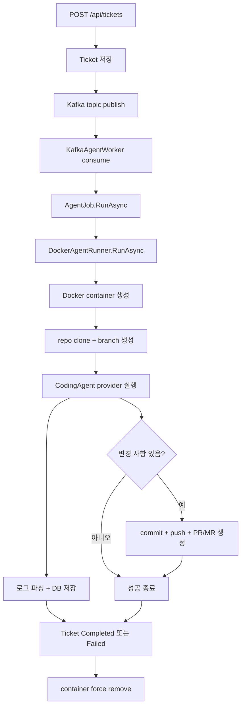

# 에이전트 실행 워커

## 무엇을 하는 기능인가

티켓이 생성되면 API가 Kafka topic에 agent job 메시지를 발행합니다.
`KafkaAgentWorker`가 메시지를 consume하고 `AgentJob.RunAsync(ticketId)`를 실행해
티켓 상태를 `Running`으로 바꾼 뒤 Docker 컨테이너 하나를 생성합니다. 컨테이너
안에서는 설정된 코딩 에이전트 provider가 작업을 수행합니다.

## 실행 흐름



## 컨테이너 안에서 하는 일

`DockerAgentRunner`는 agent image에서 다음 스크립트를 실행합니다.

1. `/work` 아래에 repository clone
2. `BASE_BRANCH` checkout
3. `agent/ticket-${TICKET_ID}` 브랜치 생성
4. Approval MCP 설정 파일 생성
5. `CodingAgent:Provider` 구현 실행 — 현재 `ClaudeCode`
6. 변경 사항이 있으면 commit/push
7. `Agent:RemoteRepositoryProvider`에 따라 GitHub PR 또는 GitLab MR 생성 후
   `PR_URL=...` 로그 출력

## 주요 설정

<!-- markdownlint-disable MD013 -->
| 설정 | 기본값 | 설명 |
| --- | --- | --- |
| `Queue:KafkaBootstrapServers` | `localhost:9092` | Kafka broker |
| `Queue:KafkaTopic` | `devautomation.agent-jobs` | agent job topic |
| `Agent:MaxConcurrentAgents` | `2` | Kafka worker concurrency |
| `Agent:AgentTimeout` | `00:30:00` | 티켓당 최대 실행 시간 |
| `Agent:ClaudeImage` | `devautomation-claude:latest` | agent container image |
| `Agent:RemoteRepositoryProvider` | `GitHub` | `GitHub` 또는 `GitLab` |
| `CodingAgent:Provider` | `ClaudeCode` | 코딩 에이전트 provider |
<!-- markdownlint-enable MD013 -->

## 로그 처리

- Docker stdout/stderr stream을 실시간으로 읽습니다.
- 각 줄은 `ClaudeStreamParser`를 거쳐 `AgentLogEvent`로 변환됩니다.
- JSON line이면 `type` 필드를 event type으로 사용합니다.
- plain text면 `stdout` event로 저장합니다.
- `SecretRedactor`가 Anthropic, GitHub, GitLab, Slack, Jira, Linear 관련 secret
  값을 `[REDACTED]`로 치환합니다.
- `AgentJob`은 로그를 25개씩 buffer 후 DB에 저장합니다.

## 코드 위치

- Kafka queue: `src/DevAutomation.Infrastructure/Queues/`
- Job orchestration: `src/DevAutomation.Infrastructure/Agents/AgentJob.cs`
- Docker 실행: `src/DevAutomation.Infrastructure/Agents/DockerAgentRunner.cs`
- Remote repository providers: `src/DevAutomation.Infrastructure/RemoteRepositories/`
- Coding agent providers: `src/DevAutomation.Infrastructure/CodingAgents/`
- stream-json parser: `src/DevAutomation.Infrastructure/Agents/ClaudeStreamParser.cs`
- secret redaction: `src/DevAutomation.Infrastructure/Agents/SecretRedactor.cs`

## 확인 방법

```bash
# agent image build
docker compose --profile build-only build agent-image

# API + DB + Kafka 실행
docker compose up --build api postgres kafka
```

## 현재 한계

- Kafka poison message DLQ와 재시도 정책은 아직 없습니다.
- 컨테이너 권한, network policy, Docker socket 접근 제한은 운영 환경에서
  별도 hardening이 필요합니다.
- Gmail notifier는 Gmail API access token 갱신을 자체 처리하지 않습니다.
