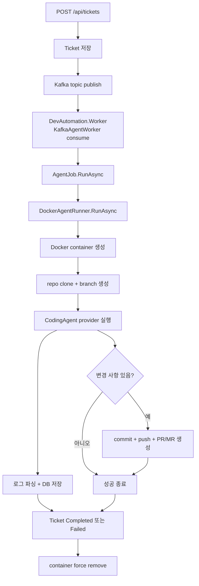

# 에이전트 실행 워커

## 무엇을 하는 기능인가

티켓이 생성되면 API가 Kafka topic에 agent job 메시지를 발행합니다.
별도 `DevAutomation.Worker` process의 `KafkaAgentWorker`가 메시지를 consume하고
`AgentJob.RunAsync(ticketId)`를 실행해 티켓 상태를 `Running`으로 바꾼 뒤 Docker
컨테이너 하나를 생성합니다. 컨테이너
안에서는 설정된 코딩 에이전트 provider가 작업을 수행합니다.

## 한눈에 보기

<!-- markdownlint-disable MD013 -->
| 항목 | 내용 |
| --- | --- |
| 시작 조건 | `DevAutomation.Worker`가 실행 중이고 Kafka topic에 agent job message가 들어옵니다. |
| 핵심 책임 | 티켓 하나를 격리된 Docker agent 실행으로 바꿉니다. |
| 주요 출력 | 실행 로그, 티켓 상태 변경, PR/MR URL입니다. |
| 실패 시 | Kafka 처리 실패는 bounded retry 후 DLQ로 보내고, agent 실행 결과 실패는 티켓을 `Failed`로 바꿉니다. |
| 같이 봐야 할 문서 | `ticket-management.md`, `approval-flow.md`, `persistence-observability.md` |
<!-- markdownlint-enable MD013 -->

## 실행 흐름



## 컨테이너 안에서 하는 일

`DockerAgentRunner`는 agent image에서 다음 스크립트를 실행합니다.

1. `/work` 아래에 repository clone
2. `BASE_BRANCH` checkout
3. `agent/ticket-${TICKET_ID}` 브랜치 생성
4. Approval MCP 설정 파일 생성
5. `CodingAgent:Provider` 구현 실행 — 현재 `ClaudeCode`
6. 변경 사항이 있으면 commit/push
7. `Agent:RemoteRepositoryProvider`에 따라 GitHub PR 또는 GitLab MR 생성 후
   `PR_URL=...` 로그 출력

## 주요 설정

<!-- markdownlint-disable MD013 -->
| 설정 | 기본값 | 설명 |
| --- | --- | --- |
| `Queue:KafkaBootstrapServers` | `localhost:9092` | Kafka broker |
| `Queue:KafkaTopic` | `devautomation.agent-jobs` | agent job topic |
| `Queue:KafkaDlqTopic` | `devautomation.agent-jobs.dlq` | exhausted/poison job DLQ topic |
| `Queue:MaxAttempts` | `3` | Kafka processing attempts before DLQ |
| `Agent:MaxConcurrentAgents` | `2` | Kafka worker concurrency |
| `Agent:AgentTimeout` | `00:30:00` | 티켓당 최대 실행 시간 |
| `Agent:ClaudeImage` | `devautomation-claude:latest` | agent container image |
| `Agent:RemoteRepositoryProvider` | `GitHub` | `GitHub` 또는 `GitLab` |
| `Agent:ExecutionIsolationProfile` | `LocalDevelopment` | `LocalDevelopment` 또는 `ProductionLike` |
| `Agent:DockerSocketMode` | `LocalDockerSocket` | host Docker socket runner 사용 여부 |
| `Agent:AllowLocalDockerSocket` | `true` in local config | local socket runner 명시적 opt-in |
| `Agent:AllowLocalDockerSocketInProductionLike` | `false` | production-like 예외 opt-in |
| `CodingAgent:Provider` | `ClaudeCode` | 코딩 에이전트 provider |
<!-- markdownlint-enable MD013 -->

## 로그 처리

- Docker stdout/stderr stream을 실시간으로 읽습니다.
- 각 줄은 `ClaudeStreamParser`를 거쳐 `AgentLogEvent`로 변환됩니다.
- JSON line이면 `type` 필드를 event type으로 사용합니다.
- plain text면 `stdout` event로 저장합니다.
- `SecretRedactor`가 secret catalog에 등록된 Anthropic, GitHub, GitLab,
  PostgreSQL connection string, Slack, Jira, Linear, Gmail, Notion, Confluence,
  Langfuse, LiteLLM 관련 secret 값을 `[REDACTED]`로 치환합니다.
- readiness profile의 `secrets.redaction.coverage` check가 catalog coverage를
  계속 점검합니다.
- `AgentJob`은 로그를 25개씩 buffer 후 DB에 저장합니다.

## 코드 위치

- Worker host: `src/DevAutomation.Worker/Program.cs`
- Kafka queue: `src/DevAutomation.Infrastructure/Queues/`
- Job orchestration: `src/DevAutomation.Infrastructure/Agents/AgentJob.cs`
- Docker 실행: `src/DevAutomation.Infrastructure/Agents/DockerAgentRunner.cs`
- Remote repository providers: `src/DevAutomation.Infrastructure/RemoteRepositories/`
- Coding agent providers: `src/DevAutomation.Infrastructure/CodingAgents/`
- stream-json parser: `src/DevAutomation.Infrastructure/Agents/ClaudeStreamParser.cs`
- secret redaction: `src/DevAutomation.Infrastructure/Agents/SecretRedactor.cs`

## 실행 격리와 secret 경계

현재 runner는 host Docker socket을 사용해 agent container를 만듭니다. Docker socket
접근은 host 권한에 준하며, agent container 자체에도 아직 CPU/memory/PID,
read-only filesystem, Linux capability 제한이 없습니다. 이 방식은
trusted local development 전용입니다. `Agent:AllowLocalDockerSocket=true`로 명시적으로
켜야 하며, `Agent:ExecutionIsolationProfile=ProductionLike` 또는 Production/Staging
환경에서는 `Agent:AllowLocalDockerSocketInProductionLike=true`가 없으면 readiness와
runner가 실행을 차단합니다.

Production-like 예외 opt-in은 임시 break-glass 용도입니다. shared/production-like
환경은 host Docker socket 대신 별도 격리 runner로 이전해야 합니다.

Agent container 환경변수는 명시적 allowlist로 제한합니다. 현재 allowlist는 ticket/git
metadata, 선택된 coding agent secret, 선택된 remote repository provider secret, 그리고
Approval MCP 실행에 필요한 PostgreSQL/Slack runtime 값입니다. 예를 들어 GitHub provider는
`GITHUB_TOKEN`만, GitLab provider는 `GITLAB_TOKEN`만 주입합니다. Langfuse observability
secret과 LiteLLM gateway secret은 redaction catalog에 포함되지만, 해당 통합이 명시적으로
구현되기 전에는 agent container에 주입하지 않습니다.

## 확인 방법

```bash
# agent image build
docker compose --profile build-only build agent-image

# API + worker + DB + Kafka 실행
docker compose up --build api worker postgres kafka
```

기대 결과:

1. `agent-image` build가 성공합니다.
2. API, worker, PostgreSQL, Kafka container가 실행됩니다.
3. 티켓을 생성하면 API가 Kafka message를 발행하고 worker가 `AgentJob.RunAsync`를
   실행합니다.
4. Kafka message는 `Attempt`, `LastFailureReason`, `LastFailedAt` metadata를 포함합니다.
5. worker 처리 예외가 `Queue:MaxAttempts` 전에 발생하면 같은 topic에 재발행한 뒤
   원본 offset을 commit합니다.
6. attempts가 소진되거나 JSON/ticket id가 잘못된 poison message는
   `Queue:KafkaDlqTopic`에 sanitized failure context와 함께 publish한 뒤 commit합니다.
7. Container exit code 0이면 티켓은 `Completed`가 됩니다. Agent가 반환한 경우에만
   PR/MR URL이 저장됩니다.
8. agent 실행 결과 실패 시 티켓은 `Failed`가 되고 `FailReason`과 execution log를 확인할 수
   있습니다. Kafka attempts 소진으로 DLQ에 들어간 기존 ticket도 `Failed`로 기록됩니다.

실패하면 먼저 볼 곳:

- API 로그: `logs/devautomation-*.log`
- worker 로그: `logs/devautomation-worker-*.log`
- 티켓 로그: `GET /api/tickets/{ticket-id}/logs`
- Docker 상태: `docker ps -a`, `docker logs <container-id>`

## 현재 한계

- Kafka retry/DLQ는 worker 처리 예외와 poison message를 bounded 처리합니다. agent가 정상 실행되어
  실패 결과를 반환한 경우에는 기존처럼 ticket failure로 종료합니다.
- local Docker socket runner는 명시적 opt-in, readiness 경고/차단, runner 실행 전 guard로
  보호하지만 운영 등급 격리 runner 자체는 아직 없습니다.
- Gmail notifier는 Gmail API access token 갱신을 자체 처리하지 않습니다.
- Container exit code 0은 변경, test 통과, PR 생성까지 보장하지 않습니다. PR URL과
  diff/test evidence를 별도로 확인합니다.
- DB save와 Kafka publish는 원자적이지 않아 publish 실패 뒤 Pending ticket이 남을
  수 있으며 자동 reconciler는 없습니다.
- Agent container에는 notifier provider와 Gmail 설정이 전달되지 않아 Approval MCP는
  현재 Slack 기본값을 사용합니다.
