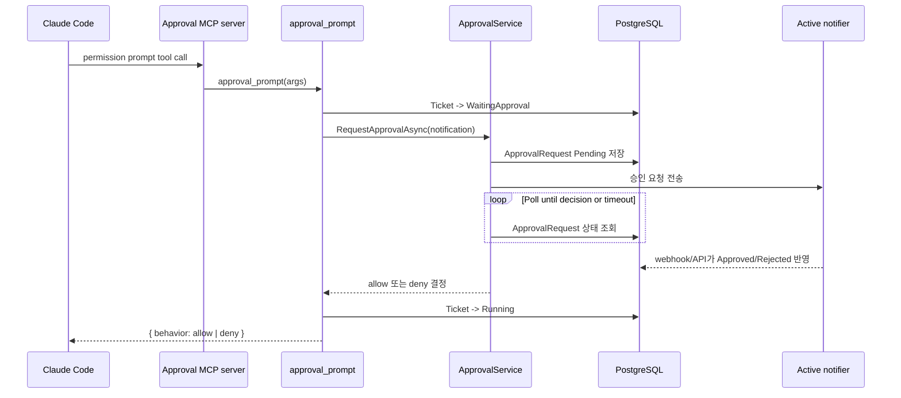
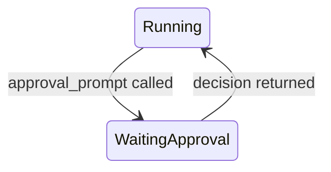

# 승인 MCP 플로우

## 무엇을 하는 기능인가

Claude Code가 민감한 작업을 수행하려고 할 때 `approval_prompt` MCP tool을
호출하면 ReplaceMe가 active notifier(Slack/Gmail/None)에 승인 요청을 만들고,
사용자가 승인/거절하거나 timeout될 때까지 대기한 뒤 Claude Code permission prompt
규격의 JSON 응답을 반환합니다.

## 구성 요소



## MCP tool 입력

`approval_prompt`는 다음 값을 받을 수 있습니다.

| 파라미터 | 설명 |
| --- | --- |
| `ticketId` | 실행 중인 티켓 ID. 없으면 `TICKET_ID` 환경변수 사용 |
| `toolName` / `tool_name` | 승인 대상 Claude Code tool 또는 작업 이름 |
| `inputJson` | 승인 대상 tool input JSON 문자열 |
| `input` | raw JSON input. `inputJson`이 없으면 이 값을 serialize |
| `summary` | notifier/API에 보여줄 사람이 읽기 쉬운 작업 요약 |

## 승인 상태와 반환값

승인 요청은 `ApprovalRequest`로 저장되며 상태는 다음 중 하나입니다.

- `Pending`
- `Approved`
- `Rejected`
- `TimedOut`

승인 시 Claude Code에 반환하는 JSON:

```json
{
  "behavior": "allow",
  "updatedInput": {
    "command": "dotnet test"
  }
}
```

거절 또는 timeout 시 반환하는 JSON:

```json
{
  "behavior": "deny",
  "message": "Rejected by user."
}
```

## 수동 승인 API

Slack 외 notifier를 쓰거나 운영자가 직접 처리해야 하는 경우 다음 API로 pending
approval을 승인/거절할 수 있습니다.

```http
POST /api/approvals/{id}/approve
POST /api/approvals/{id}/reject
{ "reason": "Not safe to run now" }
```

두 endpoint 모두 terminal 상태의 approval에는 `409 Conflict`를 반환합니다.

## 티켓 상태와의 연결

`approval_prompt`가 호출되면 실행 중인 티켓은 `WaitingApproval`로 바뀝니다.
승인 결정이 끝나면 다시 `Running`으로 돌아갑니다.



이 상태 변경도 active ticket notifier로 전송됩니다.

## Timeout 정책

`ApprovalService`는 설정된 `Approval:ApprovalTimeout`까지 DB를 polling합니다.
기본값은 10분이고 polling interval 기본값은 2초입니다. deadline 안에 결정이
없으면 `TimedOut`으로 표시하고 deny 응답을 반환합니다.

## 코드 위치

- MCP server bootstrap: `src/DevAutomation.ApprovalMcp/Program.cs`
- MCP tool: `src/DevAutomation.ApprovalMcp/Tools/ApprovalPromptTool.cs`
- 승인 polling: `src/DevAutomation.Core/Services/ApprovalService.cs`
- 승인 엔티티: `src/DevAutomation.Core/Entities/ApprovalRequest.cs`
- repository 구현: `src/DevAutomation.Infrastructure/Persistence/EfApprovalRequestRepository.cs`

## 확인 방법

1. `.env`에서 `DEVAUTOMATION_Notifier__Provider`를 선택합니다. Slack 승인 버튼을
   쓰려면 Slack bot token, signing secret, channel id를 설정합니다.
2. `docker compose --profile build-only build agent-image`로 MCP가 포함된
   agent image를 빌드합니다.
3. 티켓을 생성해 agent가 민감 작업을 요청하게 합니다.
4. active notifier에 승인 요청이 전달되는지 확인합니다.
5. 승인/거절 또는 timeout 후 `/api/approvals`에서 상태를 조회합니다.

## 현재 한계

- Slack에서 거절 사유를 따로 입력받지는 않고 `Rejected in Slack.`으로 저장합니다.
- 수동 거절 API는 사유를 받을 수 있지만, 승인 요청 입력을 수정하지는 않습니다.
- approval request의 `updatedInput` 수정 UI는 아직 없습니다. 승인 시 원래
  input을 그대로 반환합니다.
