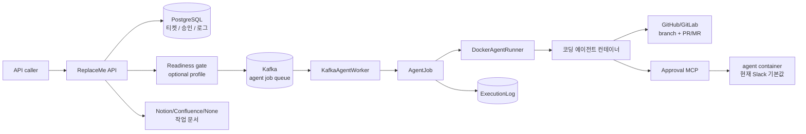
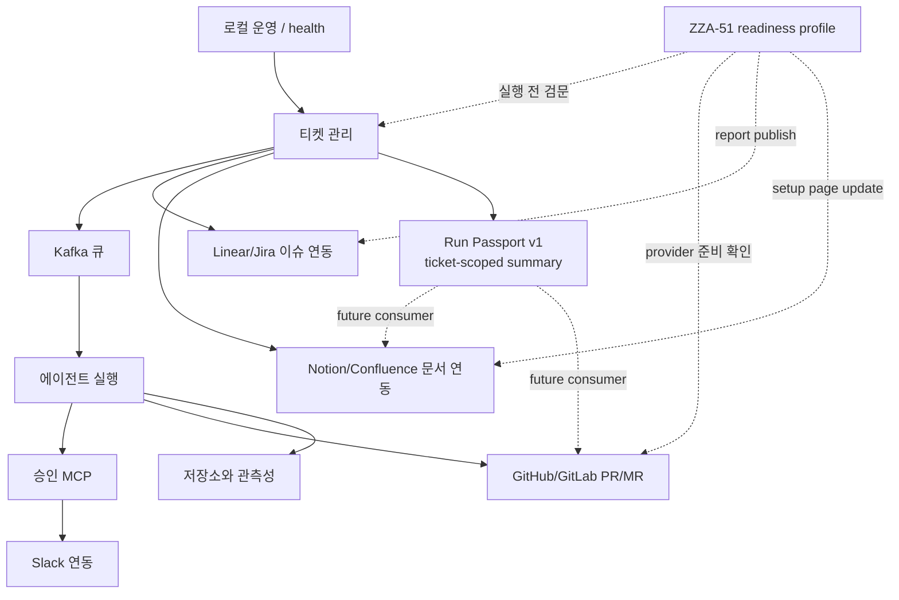

# 기능 현황

> Notion canonical:
> [기능 현황](https://app.notion.com/p/398ef22ad4fc81fa9f4ef96d82638c3d)
>
> 기준일: 2026-07-14

## 이 문서는 무엇인가

이 문서는 ReplaceMe가 지금 어떤 기능을 갖고 있는지 한눈에 보여주는 기능 지도입니다.
처음 보는 사람은 여기서 전체 흐름을 잡고, 필요한 기능 문서로 이동하면 됩니다.

ReplaceMe의 현재 핵심 흐름은 다음 한 문장으로 요약됩니다.

> API로 받은 개발 Ticket을 저장하고, 선택적으로 Linear/Jira issue를 생성·연결한 뒤,
> Kafka와 Docker agent를 거쳐 PR/MR과 실행 기록을 남깁니다.

**운영 경계:** 현재 API에는 인증/인가가 없고 API/worker가 host Docker socket을
사용합니다. trusted single-user local development 전용입니다.

## 전체 흐름 한눈에 보기

## 기능별 현황표

<!-- markdownlint-disable MD013 -->
| 기능 | 상태 | 현재 역할 | 주요 경계 | 관련 문서 |
| --- | --- | --- | --- | --- |
| 티켓 관리 | 구현 | Ticket 저장, 상태/로그/취소, Kafka enqueue | DB↔Kafka 비원자, API 인증 없음 | [`ticket-management.md`](./ticket-management.md) |
| 에이전트 실행 | 구현 | 별도 worker가 Docker에서 Claude Code 실행 | local Docker socket, exit 0이 PR을 보장하지 않음 | [`agent-execution.md`](./agent-execution.md) |
| Kafka retry/DLQ | 구현 | bounded retry, poison/exhausted DLQ | replay 도구 없음, broker 비영속 | [`agent-execution.md`](./agent-execution.md) |
| 승인 MCP | 구현 | 승인/거절/timeout을 agent에 반환 | agent container는 현재 Slack 기본값, 승인 API 인증 없음 | [`approval-flow.md`](./approval-flow.md) |
| Slack | 구현 | 상태 알림, 승인 버튼, 서명 검증 | tunnel은 Slack path만 제한 | [`slack-integration.md`](./slack-integration.md) |
| 저장/관측성 | 구현 | PostgreSQL, file log, optional OTel | alerting/retention/전역 redaction 없음 | [`persistence-observability.md`](./persistence-observability.md) |
| 로컬 운영 | 구현 | API/worker/DB/Redpanda/agent image | trusted local only | [`local-operations.md`](./local-operations.md) |
| 외부 Provider | 구현 골격 | GitHub/GitLab, Jira/Linear, Notion/Confluence | 실제 credential E2E는 기본 test에서 미검증 | [`external-providers.md`](./external-providers.md) |
| readiness | 구현 | provider/agent/secret/socket 사전 점검 | doctor는 외부 write | [`readiness-profile.md`](./readiness-profile.md) |
| Run Passport v1 | 구현 | Ticket-scoped 읽기 전용 요약, safe link/failure projection | persistence/immutable run identity/evidence 없음 | [`run-passport.md`](./run-passport.md) |
| Notion lifecycle | 설계 완료 | lifecycle/pattern bank 계약 | ZZA-52 자동 hook 미구현 | [`notion plan`](../plans/2026-07-13-002-feat-notion-lifecycle-pattern-bank-plan.md) |
| PR review packet | 설계 완료 | 문제·변경·테스트·데모 계약 | ZZA-55 자동 publication 미구현 | [`PR packet plan`](../plans/2026-07-13-003-feat-github-pr-review-packet-plan.md) |
| Langfuse/LiteLLM | Backlog | AI trace/gateway 후보 | ZZA-60/63 미구현 | [`infra roadmap`](../plans/2026-07-13-001-feat-infra-foundation-roadmap-plan.md) |
<!-- markdownlint-enable MD013 -->

## 기능 간 의존 관계

## 현재 구현된 것과 아직 아닌 것

<!-- markdownlint-disable MD013 -->
| 구분 | 구현됨 | 아직 아님 |
| --- | --- | --- |
| 실행 흐름 | 티켓, Kafka enqueue, bounded retry/DLQ, Docker agent, PR/MR 시도, Run Passport v1 | immutable run identity, run replay, outbox/reconciler, Passport persistence |
| 승인 | Approval MCP, Slack 버튼, 수동 승인 API | 인증/인가, 입력 수정 UI, MCP 강제 정책 |
| 외부 연동 | GitHub/GitLab, Jira/Linear, Notion/Confluence provider 골격 | Linear execution grammar, lifecycle/PR packet 자동 publication |
| 운영 | `/health`, readiness, Compose, file log, local OTel | persistent broker, worker health, alerting, production manifest |
| 보안 | local socket opt-in/production-like guard, selected secret allowlist | production-grade isolated runner, API auth, global log redaction |
| 검증 | 87 unit/composition/HTTP tests, local secret scanner Python tests 6개 | 실제 Compose/provider/full-agent 자동 E2E |
<!-- markdownlint-enable MD013 -->

## 처음 읽는 순서

1. 이 문서에서 전체 구조를 봅니다.
2. [`ticket-management.md`](./ticket-management.md)에서 티켓이 어떻게 생성되는지 봅니다.
3. [`agent-execution.md`](./agent-execution.md)에서 실제 코딩 에이전트 실행 흐름을
   봅니다.
4. [`approval-flow.md`](./approval-flow.md)와
   [`slack-integration.md`](./slack-integration.md)에서 사람 승인 흐름을 봅니다.
5. [`persistence-observability.md`](./persistence-observability.md)에서 어떤 기록이
   남는지 봅니다.
6. [`external-providers.md`](./external-providers.md)에서 provider 범위와 미검증
   경계를 봅니다.
7. [`local-operations.md`](./local-operations.md)에서 로컬 실행과 health check를
   확인합니다.
8. [`readiness-profile.md`](./readiness-profile.md)에서 ZZA-51 readiness profile과
   pre-run gate를 확인합니다.
9. [`../qa/README.md`](../qa/README.md)에서 직접 실행할 QA 체크리스트를 따라갑니다.

## 용어 빠른 풀이

<!-- markdownlint-disable MD013 -->
| 용어 | 쉬운 설명 |
| --- | --- |
| Ticket | 자동화가 처리할 개발 요청 단위입니다. |
| Kafka API broker | 티켓 실행 작업을 worker에게 전달하는 줄입니다. 로컬 Compose에서는 Redpanda가 이 역할을 합니다. |
| AgentJob | 티켓 하나를 실제 agent 실행으로 바꾸는 작업 단위입니다. |
| DockerAgentRunner | 격리된 Docker 컨테이너 안에서 코딩 에이전트를 실행하는 구성요소입니다. |
| Approval MCP | 코딩 에이전트가 민감 작업 전에 사용자 승인을 물어보는 통로입니다. |
| Provider | GitHub/GitLab, Linear/Jira처럼 교체 가능한 외부 도구 구현입니다. |
<!-- markdownlint-enable MD013 -->
| PR/MR | GitHub Pull Request 또는 GitLab Merge Request입니다. |
| Redaction | 로그에 secret 값이 그대로 남지 않도록 `[REDACTED]`로 가리는 처리입니다. |
| Readiness profile | 실행 전에 필요한 도구와 권한이 준비됐는지 검사하는 프로필입니다. |
