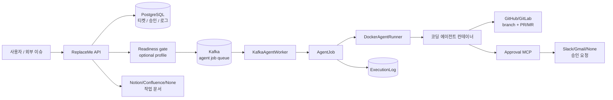
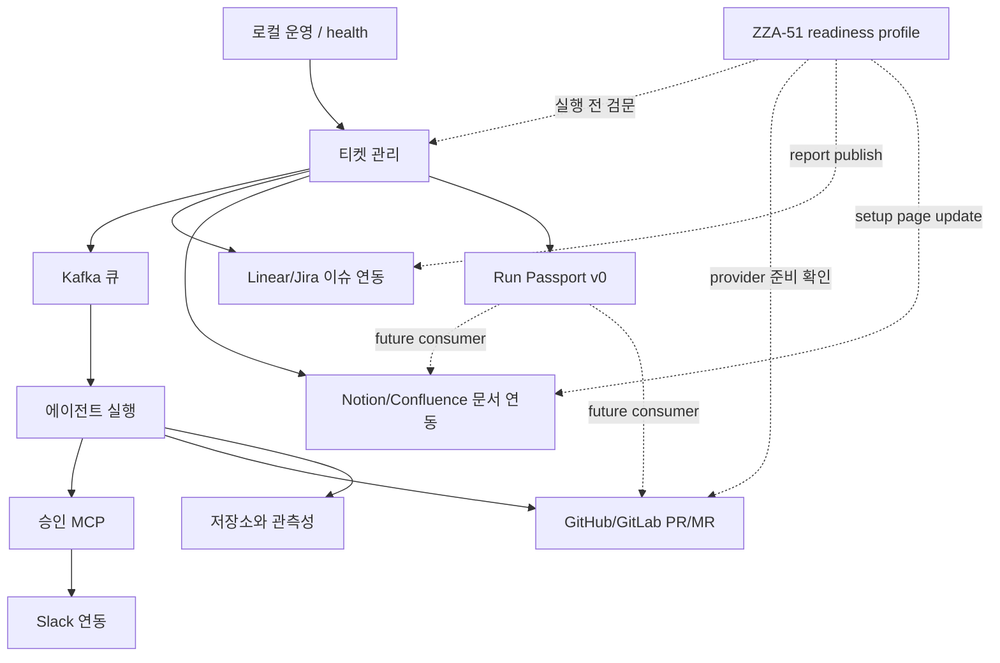

# 기능 현황

## 이 문서는 무엇인가

이 문서는 ReplaceMe가 지금 어떤 기능을 갖고 있는지 한눈에 보여주는 기능 지도입니다.
처음 보는 사람은 여기서 전체 흐름을 잡고, 필요한 기능 문서로 이동하면 됩니다.

ReplaceMe의 현재 핵심 흐름은 다음 한 문장으로 요약됩니다.

> Linear/Jira 또는 API로 들어온 개발 티켓을 저장하고, Kafka로 agent job을 보내고,
> Docker 컨테이너 안에서 코딩 에이전트를 실행한 뒤, PR/MR과 실행 기록을 남깁니다.

## 전체 흐름 한눈에 보기

## 기능별 현황표

<!-- markdownlint-disable MD013 -->
| 기능 | 현재 역할 | 주요 입력 | 주요 출력 | 관련 문서 |
| --- | --- | --- | --- | --- |
| 티켓 관리 | 개발 요구사항을 티켓으로 저장하고 agent job을 enqueue합니다. | `POST /api/tickets`, repo URL, base branch | `Ticket`, Kafka message | [`ticket-management.md`](./ticket-management.md) |
| 에이전트 실행 | Kafka message를 받아 Docker 컨테이너에서 코딩 에이전트를 실행합니다. | ticket id, agent image, repo token | branch, commit, PR/MR URL, logs | [`agent-execution.md`](./agent-execution.md) |
| 승인 MCP | 민감 작업 전 사용자의 승인/거절 결정을 받아 agent에 반환합니다. | Claude Code permission prompt | `allow` 또는 `deny` JSON | [`approval-flow.md`](./approval-flow.md) |
| Slack 연동 | 티켓 상태 알림과 승인 버튼 메시지를 처리합니다. | ticket status, approval request, Slack webhook | Slack message/update | [`slack-integration.md`](./slack-integration.md) |
| 저장소/관측성 | 티켓, 승인 요청, 실행 로그, telemetry를 저장/노출합니다. | EF Core entities, Docker logs | PostgreSQL rows, Serilog, OTLP | [`persistence-observability.md`](./persistence-observability.md) |
| 로컬 운영 | Docker Compose로 API/worker/DB/Kafka-compatible broker/agent image를 실행하고 health를 확인합니다. | `.env`, compose services | running API/worker, `/health` result | [`local-operations.md`](./local-operations.md) |
| 외부 Provider | GitHub/GitLab, Linear/Jira, Notion/Confluence 같은 외부 도구를 교체 가능하게 묶습니다. | provider options, tokens | issue/document/PR integration | Notion: 외부 Provider 연동 개요 |
| ZZA-51 readiness profile | GitHub/Linear/Notion 개인 자동화 환경이 실행 가능한지 사전 점검합니다. | profile config, provider credentials | readiness report, pre-run gate result | [`readiness-profile.md`](./readiness-profile.md) |
| Run Passport v0 | 티켓에서 실행 요약 계약을 파생해 후속 Notion/PR surface가 같은 필드명을 쓰게 합니다. | ticket id | `RunPassportSummaryResponse` | [`run-passport.md`](./run-passport.md) |
<!-- markdownlint-enable MD013 -->

## 기능 간 의존 관계

## 현재 구현된 것과 아직 아닌 것

<!-- markdownlint-disable MD013 -->
| 구분 | 구현됨 | 아직 아님 |
| --- | --- | --- |
| 실행 흐름 | 티켓 생성, Kafka enqueue, Docker agent 실행, PR/MR 생성, Run Passport v0 summary | 실패 재시도, DLQ, run replay, full Run Passport persistence |
| 승인 | Approval MCP, Slack 버튼 승인/거절, 수동 승인 API | 승인 입력 수정 UI, 거절 사유 modal |
| 외부 연동 | GitHub/GitLab, Jira/Linear, Notion/Confluence provider 골격, readiness doctor | full end-to-end Linear execution grammar |
| 운영 | `/health`, readiness profile endpoint, Docker Compose, 로그/telemetry | production manifest, 인증/인가, 운영 hardening |
| 문서 | 기능 설명 문서, ZZA-51 계획, 기능별 QA 실 테스트 문서 | Swagger 기반 API 상세 문서 |
<!-- markdownlint-enable MD013 -->

## 처음 읽는 순서

1. 이 문서에서 전체 구조를 봅니다.
2. [`ticket-management.md`](./ticket-management.md)에서 티켓이 어떻게 생성되는지 봅니다.
3. [`agent-execution.md`](./agent-execution.md)에서 실제 코딩 에이전트 실행 흐름을
   봅니다.
4. [`approval-flow.md`](./approval-flow.md)와
   [`slack-integration.md`](./slack-integration.md)에서 사람 승인 흐름을 봅니다.
5. [`persistence-observability.md`](./persistence-observability.md)에서 어떤 기록이
   남는지 봅니다.
6. [`local-operations.md`](./local-operations.md)에서 로컬 실행과 health check를
   확인합니다.
7. [`readiness-profile.md`](./readiness-profile.md)에서 ZZA-51 readiness profile과
   pre-run gate를 확인합니다.
8. [`../qa/README.md`](../qa/README.md)에서 직접 실행할 QA 체크리스트를 따라갑니다.

## 용어 빠른 풀이

<!-- markdownlint-disable MD013 -->
| 용어 | 쉬운 설명 |
| --- | --- |
| Ticket | 자동화가 처리할 개발 요청 단위입니다. |
| Kafka API broker | 티켓 실행 작업을 worker에게 전달하는 줄입니다. 로컬 Compose에서는 Redpanda가 이 역할을 합니다. |
| AgentJob | 티켓 하나를 실제 agent 실행으로 바꾸는 작업 단위입니다. |
| DockerAgentRunner | 격리된 Docker 컨테이너 안에서 코딩 에이전트를 실행하는 구성요소입니다. |
| Approval MCP | 코딩 에이전트가 민감 작업 전에 사용자 승인을 물어보는 통로입니다. |
| Provider | GitHub/GitLab, Linear/Jira처럼 교체 가능한 외부 도구 구현입니다. |
<!-- markdownlint-enable MD013 -->
| PR/MR | GitHub Pull Request 또는 GitLab Merge Request입니다. |
| Redaction | 로그에 secret 값이 그대로 남지 않도록 `[REDACTED]`로 가리는 처리입니다. |
| Readiness profile | 실행 전에 필요한 도구와 권한이 준비됐는지 검사하는 프로필입니다. |
