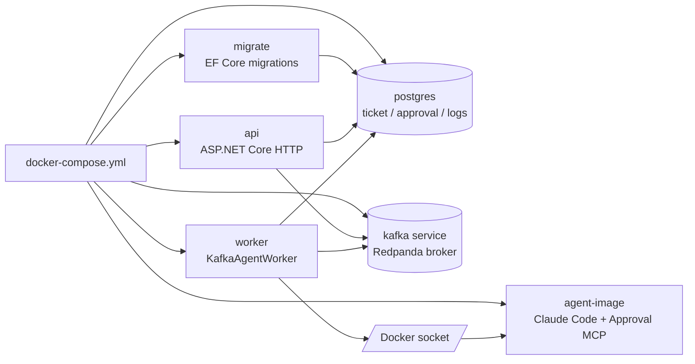
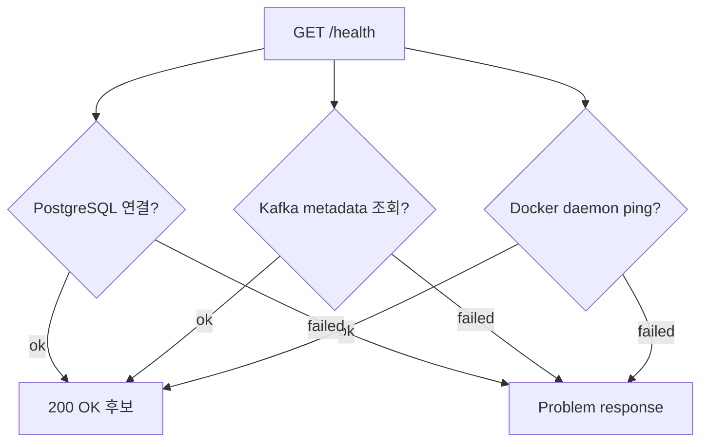

# 로컬 실행과 운영 확인

## 무엇을 하는 기능인가

ReplaceMe는 Docker Compose로 API, worker, PostgreSQL, Kafka-compatible broker,
agent image를 함께 실행할 수 있게 구성되어 있습니다. Compose의 `api` 서비스는
HTTP endpoint와 health check만 담당하고, `worker` 서비스가 Kafka agent job을
consume합니다. Compose의 `kafka` 서비스는 Redpanda를 실행하며, 애플리케이션은
Kafka API로 접근합니다. `/health` endpoint로 PostgreSQL, broker, Docker daemon
연결 상태를 확인합니다.

## 한눈에 보기

| 항목 | 내용 |
| --- | --- |
| 시작 조건 | `.env`를 준비하고 Docker Compose를 실행합니다. |
| 핵심 책임 | 로컬 API, worker, DB, Kafka-compatible broker, agent image를 함께 띄웁니다. |
| 주요 확인 | `/health`, compose container 상태, test 명령입니다. |
| 실패 시 | DB/broker/Docker 연결 문제를 먼저 확인합니다. |
| ZZA-51 이후 | `/health`와 별도로 profile readiness endpoint가 추가될 예정입니다. |

## 실행 구성



## 빠른 실행

```bash
cp .env.example .env
# .env에 Anthropic/GitHub 또는 GitLab, notifier, issue tracker, document tool 값을 입력

docker compose --profile build-only build agent-image
docker compose up --build api worker postgres kafka
```

`api`와 `worker`는 `migrate` one-shot service가 EF Core migration을 끝낸 뒤
시작합니다. `docker compose up --build api worker postgres kafka`를 실행하면
`migrate`는 dependency로 자동 실행됩니다.

API는 기본적으로 다음 주소에서 열립니다.

```text
http://localhost:8080
```

Compose의 `kafka` 서비스는 Redpanda를 사용합니다. compose 내부에서는
`kafka:9092`, 호스트에서 직접 실행하는 API/도구에서는 `localhost:9092`로 접근할
수 있게 Kafka API listener가 구성되어 있습니다.

Docker build가 내부 HTTPS proxy 뒤에서 NuGet/npm 인증서 오류를 만나면 로컬 CA
인증서(`*.crt`)를 `docker/certs/`에 둘 수 있습니다. `.crt` 파일은 git에는 ignore되며,
Dockerfiles가 build 시 image trust store에 추가합니다.

## 환경변수

<!-- markdownlint-disable MD013 -->
| 환경변수 | 설명 |
| --- | --- |
| `DEVAUTOMATION_Queue__KafkaBootstrapServers` | API/worker가 사용할 Kafka API broker |
| `DEVAUTOMATION_Queue__KafkaConsumerGroupId` | worker consumer group, 기본 `devautomation-api`(기존 offset 호환용) |
| `DEVAUTOMATION_Queue__KafkaDlqTopic` | exhausted/poison agent job을 publish할 DLQ topic |
| `DEVAUTOMATION_Queue__MaxAttempts` | worker 처리 실패를 DLQ 전에 시도할 최대 Kafka attempt 수 |
| `DEVAUTOMATION_Agent__AnthropicApiKey` | agent container에 주입할 Anthropic API key |
| `DEVAUTOMATION_Agent__RemoteRepositoryProvider` | `GitHub` 또는 `GitLab` |
| `DEVAUTOMATION_Agent__GitHubToken` | GitHub push/PR 생성 token |
| `DEVAUTOMATION_Agent__GitLabToken` | GitLab push/MR 생성 token |
| `DEVAUTOMATION_Agent__DockerNetwork` | agent container가 붙을 Docker network |
| `DEVAUTOMATION_Notifier__Provider` | `Slack`, `Gmail`, `None` |
| `DEVAUTOMATION_IssueTracker__Provider` | `Jira`, `Linear`, `None` |
| `DEVAUTOMATION_DocumentTool__Provider` | `Notion`, `Confluence`, `None` |
| `DEVAUTOMATION_Telemetry__Enabled` | OpenTelemetry export 활성화 여부 |
<!-- markdownlint-enable MD013 -->

`appsettings.json`에는 민감값을 넣지 않고, `.env` 또는 runtime environment로
주입합니다. 전체 예시는 `.env.example`을 참고하세요.

## Health check

`GET /health`는 다음 dependency를 확인합니다.



모두 정상이면 `200 OK`, 하나라도 실패하면 `Problem` 응답을 반환합니다.

`/health`는 서비스 dependency 확인용입니다. GitHub, Linear, Notion 권한까지
확인하는 기능은 `personal-github-linear-notion` readiness profile endpoint에서 따로
확인합니다.

## Readiness profile 확인

`personal-github-linear-notion` profile은 agent run 전에 GitHub, Linear, Notion,
Docker, Kafka, PostgreSQL, agent image, secret redaction 준비 상태를 확인합니다.

```bash
# 조회 전용: Linear/Notion에 쓰지 않음
curl http://localhost:8080/api/readiness/profiles/personal-github-linear-notion

# 수동 doctor: 설정된 경우 Linear/Notion에 readiness report를 남김
curl -X POST http://localhost:8080/api/readiness/profiles/personal-github-linear-notion/doctor
```

`DEVAUTOMATION_ProfileReadiness__SelectedProfile=personal-github-linear-notion`을
설정하면 `/api/tickets`와 `AgentJob.RunAsync` 앞에서 pre-run gate가 동작합니다.
required check가 실패하면 ticket 생성은 `409 ProblemDetails`로 막히고, 이미 queued
된 ticket은 `Failed` 상태와 `Readiness gate blocked:` 사유를 남깁니다.

## 개발 검증 명령

```bash
dotnet restore DevAutomation.sln
dotnet build DevAutomation.sln
dotnet test DevAutomation.sln
```

기대 결과:

1. restore가 NuGet package를 정상 복원합니다.
2. build가 compile error 없이 끝납니다.
3. test가 domain/service/infrastructure test를 통과합니다.
4. `/health`는 DB/Kafka-compatible broker/Docker가 준비된 로컬 환경에서 `200 OK`를 반환합니다.

로컬 머신에 .NET 9 runtime이 없다면 Docker SDK 이미지로 테스트할 수 있습니다.

```bash
docker run --rm -v "$PWD":/src -w /src \
  mcr.microsoft.com/dotnet/sdk:9.0 \
  dotnet test DevAutomation.sln --no-restore
```

.NET 9는 STS release라 지원 기간이 짧습니다. 장기 운영 전에 .NET 10 LTS 전환
여부를 다시 확인하세요.

## 코드 위치

- Compose: `docker-compose.yml`
- API/worker image targets: `Dockerfile`
- Agent image: `Dockerfile.agent`
- 설정: `src/DevAutomation.Api/appsettings.json`, `.env.example`
- API endpoints and health endpoint: `src/DevAutomation.Api/Program.cs`
- Worker host: `src/DevAutomation.Worker/Program.cs`
- Kafka producer/consumer: `src/DevAutomation.Infrastructure/Queues/`

## 현재 한계

- production deployment manifest는 아직 없습니다.
- Docker socket mount는 로컬 개발용이며, 운영에서는 별도 격리가 필요합니다. 현재 API도
  cancellation과 Docker health check 때문에 socket을 공유하며, worker-only Docker control
  전환은 ZZA-64에서 다룹니다.
- Kafka worker는 처리 예외를 bounded retry 후 DLQ로 보내지만, DLQ replay tooling은 아직 수동 운영 절차입니다.
