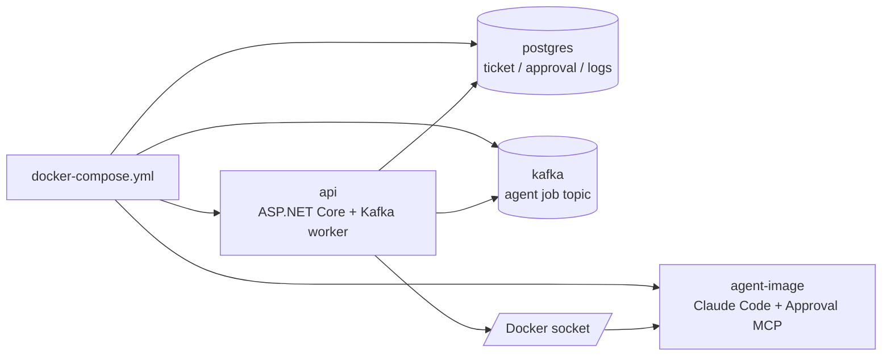
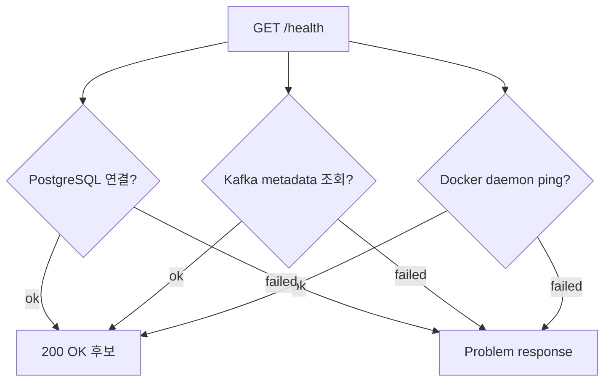

# 로컬 실행과 운영 확인

## 무엇을 하는 기능인가

ReplaceMe는 Docker Compose로 API, PostgreSQL, Kafka, agent image를 함께 실행할
수 있게 구성되어 있습니다. `/health` endpoint로 PostgreSQL, Kafka, Docker daemon
연결 상태를 확인합니다.

## 실행 구성



## 빠른 실행

```bash
cp .env.example .env
# .env에 필요한 token/channel 값 입력

docker compose --profile build-only build agent-image
docker compose up --build api postgres kafka
```

API는 기본적으로 다음 주소에서 열립니다.

```text
http://localhost:8080
```

Kafka는 compose 내부에서는 `kafka:9092`, 호스트에서 직접 실행하는 API/도구에서는
`localhost:9092`로 접근할 수 있게 dual listener로 구성되어 있습니다.

## Health check

`GET /health`는 다음 dependency를 확인합니다.



모두 정상이면 `200 OK`, 하나라도 실패하면 `Problem` 응답을 반환합니다.

## 개발 검증 명령

```bash
dotnet restore DevAutomation.sln
dotnet build DevAutomation.sln
dotnet test DevAutomation.sln
```

로컬 머신에 .NET 8 runtime이 없다면 Docker SDK 이미지로 테스트할 수 있습니다.

```bash
docker run --rm -v "$PWD":/src -w /src \
  mcr.microsoft.com/dotnet/sdk:8.0 \
  dotnet test DevAutomation.sln --no-restore
```

## 코드 위치

- Compose: `docker-compose.yml`
- API image: `Dockerfile`
- Agent image: `Dockerfile.agent`
- 설정: `src/DevAutomation.Api/appsettings.json`, `.env.example`
- Health endpoint: `src/DevAutomation.Api/Program.cs`
- Kafka producer/consumer: `src/DevAutomation.Infrastructure/Queues/`

## 현재 한계

- production deployment manifest는 아직 없습니다.
- Docker socket mount는 로컬 개발용이며, 운영에서는 별도 격리가 필요합니다.
- Kafka poison message DLQ와 재시도 정책은 아직 없습니다.
