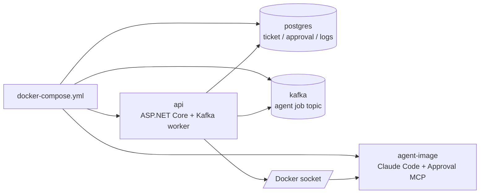
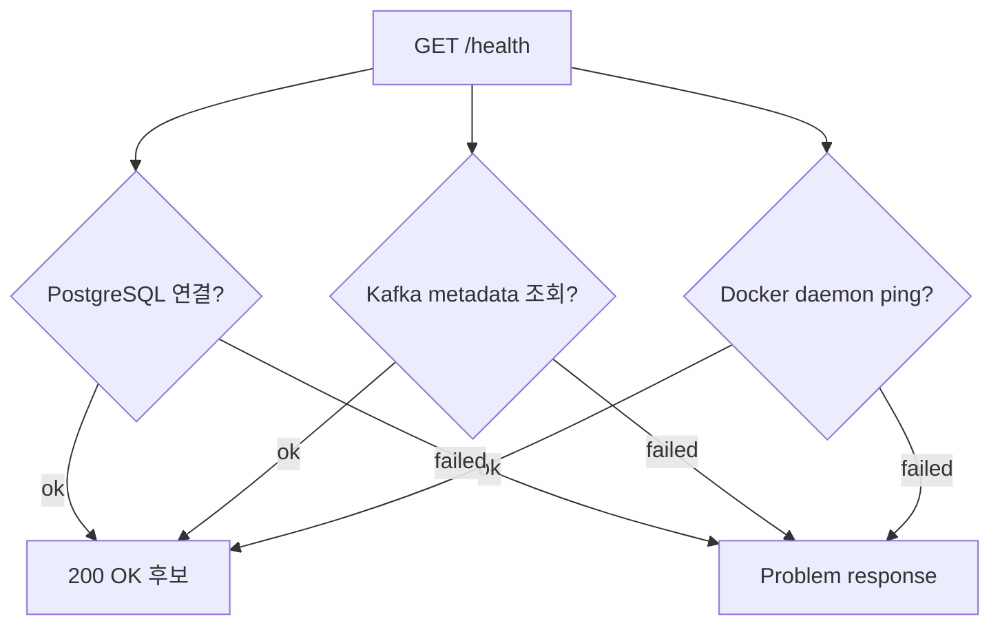

# 로컬 실행과 운영 확인

## 무엇을 하는 기능인가

ReplaceMe는 Docker Compose로 API, PostgreSQL, Kafka, agent image를 함께 실행할
수 있게 구성되어 있습니다. `/health` endpoint로 PostgreSQL, Kafka, Docker daemon
연결 상태를 확인합니다.

## 한눈에 보기

| 항목 | 내용 |
| --- | --- |
| 시작 조건 | `.env`를 준비하고 Docker Compose를 실행합니다. |
| 핵심 책임 | 로컬 API, DB, Kafka, agent image를 함께 띄웁니다. |
| 주요 확인 | `/health`, compose container 상태, test 명령입니다. |
| 실패 시 | DB/Kafka/Docker 연결 문제를 먼저 확인합니다. |
| ZZA-51 이후 | `/health`와 별도로 profile readiness endpoint가 추가될 예정입니다. |

## 실행 구성



## 빠른 실행

```bash
cp .env.example .env
# .env에 Anthropic/GitHub 또는 GitLab, notifier, issue tracker, document tool 값을 입력

docker compose --profile build-only build agent-image
docker compose up --build api postgres kafka
```

API는 기본적으로 다음 주소에서 열립니다.

```text
http://localhost:8080
```

Kafka는 compose 내부에서는 `kafka:9092`, 호스트에서 직접 실행하는 API/도구에서는
`localhost:9092`로 접근할 수 있게 dual listener로 구성되어 있습니다.

## 환경변수

<!-- markdownlint-disable MD013 -->
| 환경변수 | 설명 |
| --- | --- |
| `DEVAUTOMATION_Queue__KafkaBootstrapServers` | API/worker가 사용할 Kafka broker |
| `DEVAUTOMATION_Agent__AnthropicApiKey` | agent container에 주입할 Anthropic API key |
| `DEVAUTOMATION_Agent__RemoteRepositoryProvider` | `GitHub` 또는 `GitLab` |
| `DEVAUTOMATION_Agent__GitHubToken` | GitHub push/PR 생성 token |
| `DEVAUTOMATION_Agent__GitLabToken` | GitLab push/MR 생성 token |
| `DEVAUTOMATION_Agent__DockerNetwork` | agent container가 붙을 Docker network |
| `DEVAUTOMATION_Notifier__Provider` | `Slack`, `Gmail`, `None` |
| `DEVAUTOMATION_IssueTracker__Provider` | `Jira`, `Linear`, `None` |
| `DEVAUTOMATION_DocumentTool__Provider` | `Notion`, `Confluence`, `None` |
| `DEVAUTOMATION_Telemetry__Enabled` | OpenTelemetry export 활성화 여부 |
<!-- markdownlint-enable MD013 -->

`appsettings.json`에는 민감값을 넣지 않고, `.env` 또는 runtime environment로
주입합니다. 전체 예시는 `.env.example`을 참고하세요.

## Health check

`GET /health`는 다음 dependency를 확인합니다.



모두 정상이면 `200 OK`, 하나라도 실패하면 `Problem` 응답을 반환합니다.

`/health`는 서비스 dependency 확인용입니다. GitHub, Linear, Notion 권한까지
확인하는 기능은 ZZA-51 `personal-github-linear-notion` readiness profile에서 별도
endpoint로 추가할 예정입니다.

## 개발 검증 명령

```bash
dotnet restore DevAutomation.sln
dotnet build DevAutomation.sln
dotnet test DevAutomation.sln
```

기대 결과:

1. restore가 NuGet package를 정상 복원합니다.
2. build가 compile error 없이 끝납니다.
3. test가 domain/service/infrastructure test를 통과합니다.
4. `/health`는 DB/Kafka/Docker가 준비된 로컬 환경에서 `200 OK`를 반환합니다.

로컬 머신에 .NET 8 runtime이 없다면 Docker SDK 이미지로 테스트할 수 있습니다.

```bash
docker run --rm -v "$PWD":/src -w /src \
  mcr.microsoft.com/dotnet/sdk:8.0 \
  dotnet test DevAutomation.sln --no-restore
```

## 코드 위치

- Compose: `docker-compose.yml`
- API image: `Dockerfile`
- Agent image: `Dockerfile.agent`
- 설정: `src/DevAutomation.Api/appsettings.json`, `.env.example`
- Health endpoint: `src/DevAutomation.Api/Program.cs`
- Kafka producer/consumer: `src/DevAutomation.Infrastructure/Queues/`

## 현재 한계

- production deployment manifest는 아직 없습니다.
- Docker socket mount는 로컬 개발용이며, 운영에서는 별도 격리가 필요합니다.
- Kafka poison message DLQ와 재시도 정책은 아직 없습니다.
