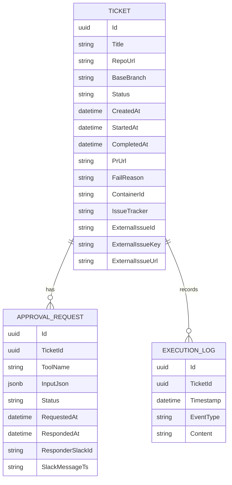
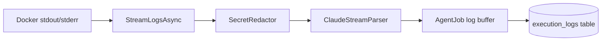

# 저장소와 관측성

## 무엇을 하는 기능인가

ReplaceMe는 PostgreSQL에 티켓, 승인 요청, 실행 로그를 저장합니다. API와
Kafka worker는 같은 `DevAutomationDbContext`를 사용하고, Serilog는 콘솔과 파일에
구조화 로그를 남깁니다. 선택적으로 OpenTelemetry trace/metric을 OTLP endpoint로
export할 수 있습니다.

## 데이터 모델



## 주요 필드

### Ticket

- `Id`
- `Title`
- `Description`
- `RepoUrl`
- `BaseBranch`
- `Status`
- `CreatedAt`, `StartedAt`, `CompletedAt`
- `PrUrl`
- `FailReason`
- `ContainerId`
- `IssueTracker`, `ExternalIssueId`, `ExternalIssueKey`, `ExternalIssueUrl`

### ApprovalRequest

- `TicketId`
- `ToolName`
- `InputJson` (`jsonb`)
- `Status`
- `RequestedAt`, `RespondedAt`
- `ResponderSlackId`
- `SlackMessageTs`
- `ResponseReason`

### ExecutionLog

- `TicketId`
- `Timestamp`
- `EventType`
- `Content`

## 마이그레이션

현재 migration은 다음 파일에 있습니다.

```text
src/DevAutomation.Infrastructure/Migrations/20260707000000_InitialCreate.cs
src/DevAutomation.Infrastructure/Migrations/20260707010000_AddIssueTrackerFields.cs
```

API 시작 시 `Database:ApplyMigrations`가 `true`이면 자동으로
`Database.MigrateAsync()`를 실행합니다.

## 실행 로그 저장

Agent container 로그는 다음 흐름으로 저장됩니다.



- JSON line: `type` 값을 event type으로 사용
- 일반 line: `stdout` event type 사용
- secret 값: 저장 전에 `[REDACTED]`로 치환
- redaction 대상: Anthropic, GitHub, GitLab, Slack, Jira, Linear secret
- buffer size: 25개 단위 저장

## Serilog와 OpenTelemetry

API는 Serilog를 사용해 다음 sink로 기록합니다.

- console
- rolling file: `logs/devautomation-.log`

Docker Compose에서는 `./logs:/app/logs` volume을 연결해 컨테이너 밖에서도 로그를
확인할 수 있습니다.

`Telemetry:Enabled=true`이면 ASP.NET Core, HttpClient, runtime metric과
`DevAutomationTelemetry` activity/meter를 OTLP exporter로 전송합니다.

## 코드 위치

- EF Core DbContext: `src/DevAutomation.Infrastructure/Persistence/DevAutomationDbContext.cs`
- Design-time factory: `src/DevAutomation.Infrastructure/Persistence/DesignTimeDbContextFactory.cs`
- Approval repository: `src/DevAutomation.Infrastructure/Persistence/EfApprovalRequestRepository.cs`
- Migrations: `src/DevAutomation.Infrastructure/Migrations/`
- Telemetry: `src/DevAutomation.Infrastructure/Telemetry/DevAutomationTelemetry.cs`
- Log parser/redactor: `src/DevAutomation.Infrastructure/Agents/ClaudeStreamParser.cs`,
  `src/DevAutomation.Infrastructure/Agents/SecretRedactor.cs`

## 확인 방법

```bash
# DB/Kafka 포함 전체 실행
docker compose up --build api postgres kafka

# 티켓 목록/API 조회
curl http://localhost:8080/api/tickets
curl http://localhost:8080/api/approvals
curl http://localhost:8080/api/tickets/{ticket-id}/logs

# 파일 로그 확인
ls logs/
```

## 현재 한계

- structured log에 ticket id correlation enrichment를 더 강화할 여지가 있습니다.
- execution log retention/cleanup 정책은 아직 없습니다.
- OTLP collector는 compose에 포함되어 있지 않습니다.
