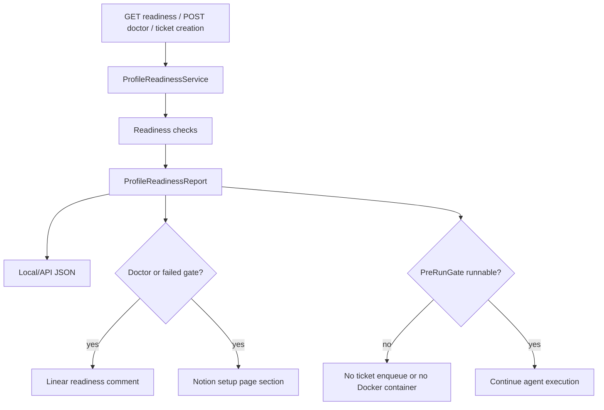
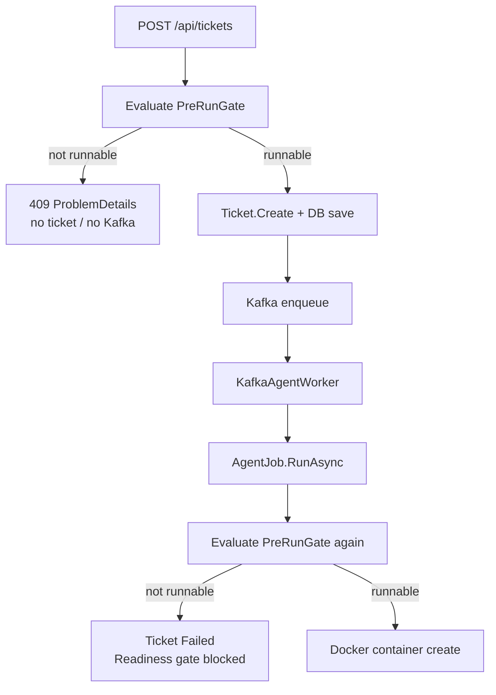

# personal-github-linear-notion readiness profile

<!-- markdownlint-disable -->

## 무엇을 하는 기능인가

`personal-github-linear-notion` readiness profile은 agent run 전에 개인 개발 자동화
환경이 준비되었는지 확인하는 안전문입니다.

`/health`가 PostgreSQL, Kafka, Docker 같은 서비스 dependency를 확인한다면,
readiness profile은 GitHub, Linear, Notion, agent image, secret redaction까지 포함해
“지금 이 profile로 agent를 실행해도 되는가?”를 판단합니다.

## 한눈에 보기

| 항목 | 내용 |
| --- | --- |
| 시작 조건 | 사용자가 readiness endpoint를 호출하거나 ticket 생성을 요청합니다. |
| 핵심 책임 | required check 실패 시 agent work를 시작하지 않게 막습니다. |
| 주요 출력 | structured readiness report, Linear comment, Notion setup page section입니다. |
| 실패 시 | local/API report에 실패 check와 repair hint를 남깁니다. |
| 같이 봐야 할 문서 | `local-operations.md`, `ticket-management.md`, ZZA-51 plan |

## Mode별 동작

| Mode | 호출 | 외부 쓰기 | 설명 |
| --- | --- | --- | --- |
| Inspect | `GET /api/readiness/profiles/{profileName}` | 없음 | 현재 준비 상태를 JSON으로만 확인합니다. |
| Doctor | `POST /api/readiness/profiles/{profileName}/doctor` | 있음 | Linear/Notion publisher를 실행하고 결과를 report에 포함합니다. |
| PreRunGate | `/api/tickets`, `AgentJob.RunAsync` | 실패 시 publish 시도 | required failure가 있으면 agent work를 시작하지 않습니다. |

## 전체 흐름



## Check 목록

| Check ID | 기본 severity | 확인 대상 |
| --- | --- | --- |
| `local.postgres.connectivity` | required | PostgreSQL 연결 가능 여부 |
| `local.kafka.connectivity` | required | Kafka broker metadata 조회 가능 여부 |
| `local.docker.ping` | required | Docker daemon 접근 가능 여부 |
| `agent.docker.socket.posture` | required/warning | local Docker socket opt-in posture |
| `agent.image.available` | required | configured agent image 존재 여부 |
| `github.agent.gh.capability` | required | GitHub token, repo config, agent image 안의 `git`/`gh` 명령 |
| `linear.read.access` | required | Linear team/project/readiness issue read access |
| `notion.read.access` | required | Notion setup page read access |
| `secrets.redaction.coverage` | warning | configured secret 값의 redaction coverage |

## Pre-run gate 위치



## 주요 설정

| 환경변수 | 설명 |
| --- | --- |
| `DEVAUTOMATION_ProfileReadiness__SelectedProfile` | `personal-github-linear-notion`이면 pre-run gate를 활성화합니다. |
| `DEVAUTOMATION_ProfileReadiness__GitHub__RepositoryUrl` | readiness 대상 GitHub repo URL입니다. |
| `DEVAUTOMATION_ProfileReadiness__Linear__TeamId` | Linear team ID입니다. |
| `DEVAUTOMATION_ProfileReadiness__Linear__ProjectId` | Linear project ID입니다. |
| `DEVAUTOMATION_ProfileReadiness__Linear__ReadinessIssueId` | readiness comment를 남길 Linear issue ID입니다. |
| `DEVAUTOMATION_ProfileReadiness__Notion__SetupPageId` | readiness section을 남길 Notion setup page ID입니다. |
| `DEVAUTOMATION_ProfileReadiness__Publishers__LinearSeverity` | Linear publisher 실패 severity입니다. |
| `DEVAUTOMATION_ProfileReadiness__Publishers__NotionSeverity` | Notion publisher 실패 severity입니다. |
| `DEVAUTOMATION_ProfileReadiness__Checks__SecretsRedactionSeverity` | secret redaction gap severity입니다. |
| `DEVAUTOMATION_Agent__ExecutionIsolationProfile` | `LocalDevelopment` 또는 `ProductionLike`입니다. |
| `DEVAUTOMATION_Agent__DockerSocketMode` | 현재 local runner는 `LocalDockerSocket`입니다. |
| `DEVAUTOMATION_Agent__AllowLocalDockerSocket` | local socket runner의 명시적 opt-in입니다. |
| `DEVAUTOMATION_Agent__AllowLocalDockerSocketInProductionLike` | production-like 예외 opt-in입니다. |

## Docker socket posture

Local Docker socket mode는 Docker Desktop/Compose 기반 개발을 위한 local-only runner입니다.
Readiness는 다음처럼 판단합니다.

- `AllowLocalDockerSocket=false`이면 local runner가 명시적으로 허용되지 않았으므로
  required failure입니다.
- `ExecutionIsolationProfile=LocalDevelopment`이고 opt-in이 있으면 runnable이지만 warning을
  남겨 shared 환경 재사용을 막습니다.
- `ExecutionIsolationProfile=ProductionLike`, `ASPNETCORE_ENVIRONMENT=Production`, 또는
  `DOTNET_ENVIRONMENT=Production` 계열에서 production-like opt-in이 없으면 required
  failure입니다.
- production-like opt-in이 있어도 warning으로 남기며, 별도 격리 runner로 이전해야 합니다.

## 코드 위치

- API endpoints: `src/DevAutomation.Api/Program.cs`
- report models/interfaces: `src/DevAutomation.Core/Readiness/`
- API DTOs: `src/DevAutomation.Core/Contracts/Readiness/`
- options: `src/DevAutomation.Core/Options/ProfileReadinessOptions.cs`
- service orchestration: `src/DevAutomation.Infrastructure/Readiness/ProfileReadinessService.cs`
- checks: `src/DevAutomation.Infrastructure/Readiness/Checks/`
- publishers: `src/DevAutomation.Infrastructure/Readiness/Publishers/`
- secret catalog: `src/DevAutomation.Infrastructure/Readiness/SecretCatalog.cs`
- pre-run safety net: `src/DevAutomation.Infrastructure/Agents/AgentJob.cs`

## 확인 방법

```bash
# 조회 전용
curl http://localhost:8080/api/readiness/profiles/personal-github-linear-notion

# 수동 doctor + publisher 실행
curl -X POST http://localhost:8080/api/readiness/profiles/personal-github-linear-notion/doctor
```

기대 결과:

1. 응답에는 `isRunnable`, `checks`, `reportSurfaceResults`, `repairHint`가 포함됩니다.
2. GET은 Linear comment나 Notion page를 만들지 않습니다.
3. POST doctor는 설정된 Linear/Notion target에 readiness result를 남깁니다.
4. `SelectedProfile`을 설정하면 `/api/tickets` 전에 required failure가 차단됩니다.

## 현재 한계

- GitHub PR 생성 자체를 dummy PR로 증명하지는 않습니다.
- Linear/Notion publisher는 configured target에 실제 report를 남기므로 별도 sandbox target을 쓰는 것이 안전합니다.
- 실제 provider integration test는 개인 credential이 필요하므로 기본 test suite에서는 fake 중심으로 검증합니다.

<!-- markdownlint-enable -->
