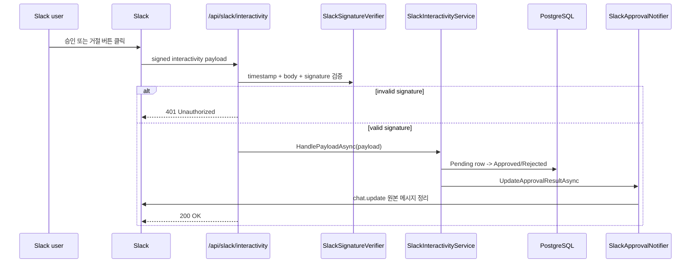

# Slack 연동

## 무엇을 하는 기능인가

ReplaceMe는 Slack을 두 가지 용도로 사용합니다.

1. 티켓 상태 변경 알림
2. 민감 작업 승인/거절 버튼 메시지

Slack interactivity webhook은 서명 검증을 통과한 요청만 처리하고, 승인 결과를
원본 메시지에 반영합니다.

## 한눈에 보기

| 항목 | 내용 |
| --- | --- |
| 시작 조건 | 티켓 상태가 바뀌거나 approval request가 생성됩니다. |
| 핵심 책임 | Slack 메시지 전송, 승인/거절 버튼 처리, 서명 검증입니다. |
| 주요 출력 | Slack channel message와 approval result update입니다. |
| 실패 시 | signature 실패는 `401`, 설정 누락은 skip log로 남깁니다. |
| 같이 봐야 할 문서 | `approval-flow.md`, `ticket-management.md` |

## 알림 종류

| 상황 | Slack 동작 |
| --- | --- |
| 티켓 시작 | `Ticket Running: ...` 메시지 전송 |
| 승인 대기 | `Ticket WaitingApproval: ...` 메시지 전송 |
| 완료 | PR URL이 있으면 포함해 `Ticket Completed: ...` 전송 |
| 실패 | 실패 사유를 포함해 `Ticket Failed: ...` 전송 |
| 승인 요청 | `[승인] [거절]` 버튼이 있는 Block Kit 메시지 전송 |
| 승인 결과 | 기존 승인 메시지를 결과 요약으로 업데이트 |

## Slack 버튼 처리 흐름



## 보안: Slack 서명 검증

`SlackSignatureVerifier`는 Slack의 서명 방식을 따릅니다.

1. `X-Slack-Request-Timestamp`가 있는지 확인
2. timestamp가 현재 시각 기준 5분 이내인지 확인
3. `v0:{timestamp}:{body}` base string 생성
4. signing secret으로 HMAC-SHA256 계산
5. `CryptographicOperations.FixedTimeEquals`로 constant-time 비교

서명 검증 실패 시 API는 `401 Unauthorized`를 반환합니다.

## 설정

`.env` 또는 환경변수로 설정합니다.

```env
DEVAUTOMATION_Slack__BotToken=xoxb-...
DEVAUTOMATION_Slack__SigningSecret=...
DEVAUTOMATION_Slack__ChannelId=C0123456789
```

Slack이 설정되지 않은 경우 ticket status 알림은 skip log를 남기고,
approval API call은 `not-configured` timestamp를 가진 성공 응답처럼 동작해
로컬 개발이 막히지 않게 합니다.

## 코드 위치

- Slack Web API client: `src/DevAutomation.Infrastructure/Slack/SlackApprovalNotifier.cs`
- Interactivity handler: `src/DevAutomation.Infrastructure/Slack/SlackInteractivityService.cs`
- Signature verifier: `src/DevAutomation.Infrastructure/Slack/SlackSignatureVerifier.cs`
- Action ID 상수: `src/DevAutomation.Infrastructure/Slack/SlackApprovalActionIds.cs`
- API route: `src/DevAutomation.Api/Program.cs`

## 확인 방법

```bash
# Slack interactivity endpoint
POST http://localhost:8080/api/slack/interactivity
```

Slack App 설정에서 interactivity request URL을 위 endpoint로 연결합니다.
로컬에서 테스트하려면 ngrok 같은 tunnel이 필요합니다.

기대 결과:

1. 티켓 상태가 바뀌면 channel에 상태 메시지가 전송됩니다.
2. approval request가 생기면 승인/거절 버튼 메시지가 전송됩니다.
3. Slack 사용자가 버튼을 누르면 원본 메시지가 결과 요약으로 업데이트됩니다.
4. 잘못된 서명이나 오래된 timestamp 요청은 `401 Unauthorized`가 됩니다.

주의:

- `POST /api/slack/interactivity`는 Slack 서명 payload가 필요하므로 단순 curl로는
  성공 케이스를 재현하기 어렵습니다.
- 로컬 테스트는 ngrok 등으로 Slack이 접근 가능한 URL을 만들어야 합니다.

## 현재 한계

- Slack App manifest 자동 생성 문서는 아직 없습니다.
- 승인 거절 사유 입력 modal은 아직 없습니다.
- Slack API rate limit에 대한 재시도 정책은 아직 없습니다.
