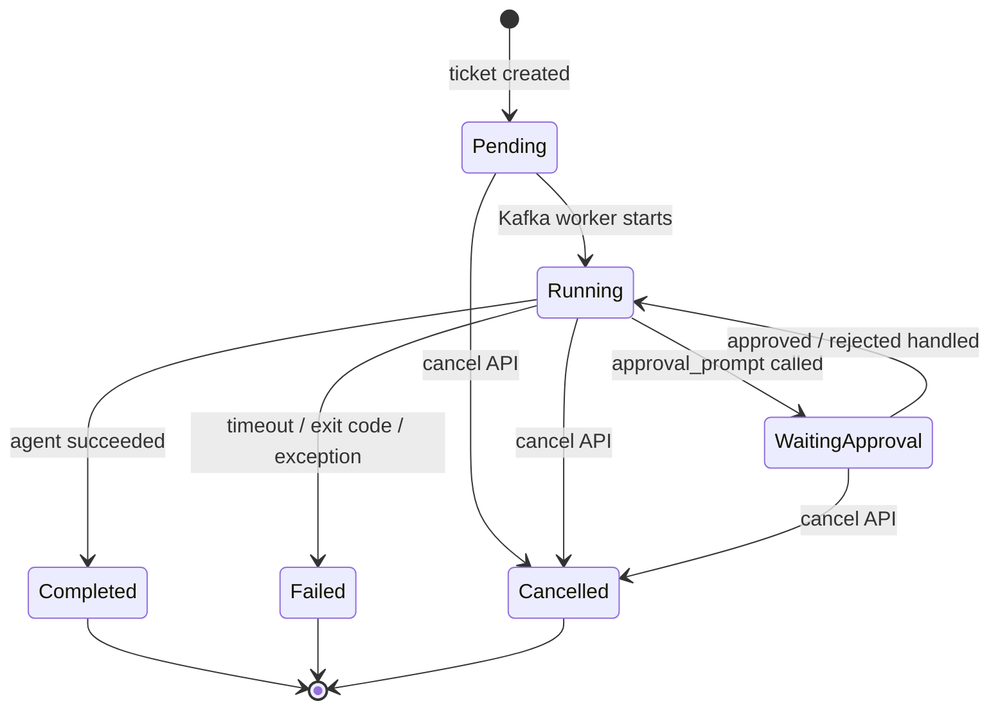

# 티켓 관리 API

## 무엇을 하는 기능인가

사용자가 개발 요구사항을 티켓으로 등록하면 ReplaceMe가 이를 DB에 저장하고,
즉시 Kafka topic에 에이전트 실행 메시지를 발행합니다. 이후 API로 티켓 상태,
목록, 로그를 확인하거나 실행 중인 티켓을 취소할 수 있습니다.

## 한눈에 보기

<!-- markdownlint-disable MD013 -->
| 항목 | 내용 |
| --- | --- |
| 시작 조건 | 사용자가 `POST /api/tickets`로 개발 요청을 보냅니다. |
| 핵심 책임 | 티켓 저장, 상태 조회, 취소, 로그 조회, agent job enqueue입니다. |
| 주요 출력 | `TicketResponse`, Kafka job message, 실행 로그입니다. |
| 실패 시 | agent 실행 단계에서 `Failed`로 기록합니다. |
| readiness gate | `personal-github-linear-notion`이 선택되면 required failure를 enqueue 전에 차단합니다. |
<!-- markdownlint-enable MD013 -->

## 구현된 엔드포인트

<!-- markdownlint-disable MD013 -->
| 메서드 | 경로 | 설명 |
| --- | --- | --- |
| `POST` | `/api/tickets` | 티켓 생성 + readiness gate 통과 시 Kafka agent job enqueue |
| `GET` | `/api/tickets/{id}` | 단일 티켓 상태 조회 |
| `GET` | `/api/tickets/{id}/run-passport` | 티켓에서 파생한 Run Passport v0 summary 조회 |
| `GET` | `/api/tickets` | 상태 필터와 페이징을 지원하는 목록 조회 |
| `POST` | `/api/tickets/{id}/cancel` | 티켓 취소 + 연결된 컨테이너 중지 시도 |
| `GET` | `/api/tickets/{id}/logs` | 티켓별 실행 로그 조회 |
| `POST` | `/api/tickets/{id}/documents` | active document tool에 티켓 문서 생성 |
<!-- markdownlint-enable MD013 -->

## 요청/응답 모델

티켓 생성 요청은 `CreateTicketRequest`를 사용합니다.

```json
{
  "title": "Add login API",
  "description": "Implement login endpoint and tests",
  "repoUrl": "https://github.com/org/repo.git",
  "baseBranch": "main",
  "createExternalIssue": false,
  "externalIssueId": null,
  "externalIssueKey": null,
  "externalIssueUrl": null
}
```

응답은 `TicketResponse` 형태로 티켓의 현재 상태, PR/MR URL, 실패 사유,
외부 이슈 tracker reference를 반환합니다. `GET /api/tickets/{id}/run-passport`는
같은 티켓에서 `RunPassportSummaryResponse`를 파생해 후속 Notion/PR surface가
공유할 v0 summary contract를 반환합니다.

`createExternalIssue`가 `true`이거나 기존 이슈 reference를 붙이는 경우
`IssueTracker:Provider`는 `Jira` 또는 `Linear`여야 합니다.

## 상태 전이

현재 티켓 상태는 다음 흐름을 지원합니다.



- `Pending`: 티켓 생성 직후
- `Running`: Kafka worker가 시작되어 agent container가 실행 중
- `WaitingApproval`: MCP approval tool이 active notifier 승인을 기다리는 중
- `Completed`: agent container가 성공 종료하고 PR/MR URL을 기록한 상태
- `Failed`: agent timeout, container exit code, 예외 발생
- `Cancelled`: 사용자가 취소 API를 호출한 상태

## 코드 위치

- API 라우팅: `src/DevAutomation.Api/Program.cs`
- 요청/응답 contract: `src/DevAutomation.Core/Contracts/TicketContracts.cs`
- 도메인 엔티티: `src/DevAutomation.Core/Entities/Ticket.cs`
- 상태 전이 서비스: `src/DevAutomation.Core/Services/TicketStateMachine.cs`
- 실행 잡: `src/DevAutomation.Infrastructure/Agents/AgentJob.cs`

## 확인 방법

```bash
curl -X POST http://localhost:8080/api/tickets \
  -H 'Content-Type: application/json' \
  -d '{
    "title": "Update README",
    "description": "Add setup instructions and tests",
    "repoUrl": "https://github.com/example/repo.git",
    "baseBranch": "main"
  }'

curl http://localhost:8080/api/tickets
curl http://localhost:8080/api/tickets/{ticket-id}
curl http://localhost:8080/api/tickets/{ticket-id}/run-passport
curl http://localhost:8080/api/tickets/{ticket-id}/logs
```

기대 결과:

1. `POST /api/tickets`는 새 티켓 ID와 `Pending` 상태를 반환합니다.
2. Kafka worker가 message를 consume하면 상태가 `Running`으로 바뀝니다.
3. agent 실행이 끝나면 `Completed` 또는 `Failed`가 됩니다.
4. `GET /api/tickets/{ticket-id}/run-passport`에서 실행 요약 계약을 확인할 수 있습니다.
5. `GET /api/tickets/{ticket-id}/logs`에서 agent log를 확인할 수 있습니다.
6. readiness required failure가 있으면 `POST /api/tickets`는 `409 ProblemDetails`를
   반환하고 ticket과 Kafka message를 만들지 않습니다.

실패하면 먼저 볼 곳:

- `FailReason` 필드
- `GET /api/tickets/{ticket-id}/logs`
- API/worker 로그 `logs/devautomation-.log`

## 현재 한계

- API 인증/인가가 아직 없습니다.
- 실패한 티켓 재실행 API는 아직 없습니다.
- `cancel`은 티켓 상태를 먼저 취소로 바꾸고, 이후 Docker container stop을
  best-effort로 시도합니다.
