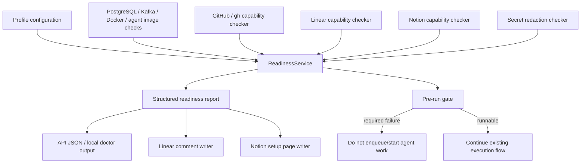

<!-- markdownlint-disable -->

# Personal GitHub Linear Notion Profile - Plan

## Goal Capsule

| Field | Value |
| --- | --- |
| Objective | Implement the v1 `personal-github-linear-notion` readiness profile for ReplaceMe. |
| Product authority | Product scope is defined by ZZA-51 and the Product Contract in this plan. |
| Execution profile | Code implementation in the ReplaceMe repo. |
| Stop conditions | Stop before changing product scope for Linear issue execution, Run Passport schema, PR packet generation, or Notion lifecycle documents. |
| Tail ownership | After implementation, update project-tracking links/status manually only for work-management bookkeeping; readiness report publishing itself is part of the implemented scope. |

---

## Product Contract

Product Contract preservation: Product Contract is carried forward from the confirmed ce-brainstorm scope and refined only where implementation planning exposed required safety semantics.

### Summary

`personal-github-linear-notion` is ReplaceMe's first personal automation profile.
The v1 product is a readiness profile: it verifies that GitHub, Linear, Notion, Docker, Kafka, and PostgreSQL are ready before an agent run, blocks unsafe runs by default, and publishes a clear report across local output, Linear, and Notion.

### Problem Frame

ReplaceMe already has provider options for GitHub/GitLab, Linear/Jira, Notion/Confluence, notifiers, and coding agents, but the user's desired workflow is not yet a single validated operating mode.
Today `/health` confirms infrastructure dependencies, while provider readiness such as GitHub PR capability, Linear comment capability, and Notion write capability is discovered later when a workflow touches each integration.
For personal automation, late discovery is expensive: a coding agent may spend time and tokens before the system learns that it cannot create a PR, comment on the controlling issue, or write to the project wiki.

### Key Decisions

- **Readiness before end-to-end automation.** v1 defines whether the personal environment is safe to run; Linear issue execution rules, Run Passport detail, PR packet generation, and Notion lifecycle documents stay in their own follow-up issues.
- **Fail closed by default.** Required checks that fail make the profile not runnable until fixed; warning-only behavior is reserved for non-blocking checks.
- **Manual and pre-run modes both matter.** The user can run the readiness profile manually, and ReplaceMe also evaluates it before an agent run starts.
- **Three report surfaces are in scope.** The same readiness result must be understandable locally, as a Linear comment, and on the Notion project setup page before ZZA-51 is considered complete.

### Actors

- A1. **Personal developer.** The user running ReplaceMe locally and deciding whether the automation environment is ready.
- A2. **ReplaceMe server.** The orchestrator that evaluates readiness and decides whether a run may proceed.
- A3. **Linear project.** The issue-tracking surface where readiness failures and next actions can be visible.
- A4. **Notion project wiki.** The durable setup/memory surface for readiness status and repair instructions.
- A5. **GitHub repository.** The code/review surface whose push and PR capabilities must be validated before agent work is trusted.

### Requirements

**Profile identity and scope**

- R1. The profile must be named `personal-github-linear-notion` and represent the user's first-class personal automation mode.
- R2. The profile must treat GitHub as the code/review surface, Linear as the issue tracker and command surface, and Notion as the wiki/memory surface.
- R3. The profile must not redefine the full Linear issue execution contract, Run Passport schema, PR packet content, or Notion lifecycle document behavior beyond the readiness needs of this profile.

**Readiness checks**

- R4. The profile must check core local infrastructure readiness: PostgreSQL, Kafka, Docker, and the agent image prerequisites needed to start an agent run.
- R5. The profile must check GitHub readiness for the personal workflow: repository access, authenticated branch push prerequisites, PR creation prerequisites, and the `gh`/token capability inside the configured agent execution environment.
- R6. The profile must check Linear readiness: configured team access, issue visibility, and ability to write the status/comment that tells the user what happened.
- R7. The profile must check Notion readiness: access to the configured project wiki location and ability to create or update the readiness/setup page.
- R8. The profile must check secret-handling readiness, including whether configured secrets that can appear in agent logs are covered by redaction.

**Decision policy**

- R9. The profile must classify each check as `required` or `warning` so fail-closed behavior is predictable.
- R10. If any required check fails, the profile must mark the environment as not runnable and prevent a pre-run agent execution from starting.
- R11. Warning checks must be visible in the report without blocking the run.
- R12. Override behavior is out of v1 unless it is documented as a future decision; v1's default is to stop on required failures.

**Report surfaces**

- R13. The local report must give a developer enough information to fix the environment without opening Linear or Notion.
- R14. The Linear report must summarize pass/fail status and list the next repair action in the relevant project or issue context.
- R15. The Notion report must preserve the current profile status and repair guidance as project setup knowledge.
- R16. The three report surfaces must describe the same readiness result, even if their formatting differs.

**Manual doctor and pre-run gate**

- R17. Manual doctor mode must let the user inspect readiness without attempting an agent run.
- R18. Pre-run gate mode must evaluate readiness before spending agent execution work.
- R19. Pre-run gate mode must fail early enough that no code-changing agent work starts when required readiness is missing.
- R20. Both modes must use the same check definitions and severity policy.

### Key Flows

- F1. Manual readiness doctor
  - **Trigger:** The personal developer asks ReplaceMe to inspect the `personal-github-linear-notion` profile.
  - **Actors:** A1, A2, A3, A4, A5.
  - **Steps:** ReplaceMe evaluates local infrastructure and provider capabilities, classifies failures as required or warning, returns a local report, and writes matching summaries to Linear and Notion when manual doctor publishing is requested.
  - **Outcome:** The user sees whether the profile is runnable and what to fix next.
  - **Covered by:** R4-R18.

- F2. Pre-run readiness gate
  - **Trigger:** ReplaceMe is about to start an agent run under the `personal-github-linear-notion` profile.
  - **Actors:** A1, A2, A3, A4, A5.
  - **Steps:** ReplaceMe evaluates the same readiness contract used by manual doctor mode, blocks execution on required failures, and publishes the failure report before any code-changing agent work begins.
  - **Outcome:** Unsafe or incomplete environments do not start agent work.
  - **Covered by:** R9-R20.

- F3. Degraded report delivery
  - **Trigger:** One of the report surfaces is itself unavailable during readiness evaluation.
  - **Actors:** A1, A2, A3, A4.
  - **Steps:** ReplaceMe still returns the local report, marks unavailable report surfaces clearly, and treats failed required report surfaces according to the severity policy.
  - **Outcome:** The user receives a usable local diagnosis even when Linear or Notion cannot be updated.
  - **Covered by:** R9-R16.

### Acceptance Examples

- AE1. **Covers R5, R10, R18.** Given GitHub PR creation prerequisites are missing in the configured agent execution environment, when pre-run gate mode runs, then ReplaceMe marks the profile not runnable and does not start agent work.
- AE2. **Covers R6, R13, R14.** Given Linear access fails, when manual doctor mode runs, then the local report explains the Linear failure and no Linear comment is assumed to have been written.
- AE3. **Covers R7, R15, R16.** Given Notion write access succeeds, when readiness completes, then the Notion setup page reflects the same pass/fail result as the local report.
- AE4. **Covers R8, R11.** Given a configured provider secret is not covered by redaction but the team classifies it as warning for v1, when readiness completes, then the report surfaces the warning without blocking the run.
- AE5. **Covers R17, R20.** Given the user runs manual doctor mode and then starts an agent run, when both use the same profile configuration, then the checks and severities are consistent across both modes.

### Success Criteria

- A new reader can explain what `personal-github-linear-notion` guarantees without reading implementation code.
- A planner can derive a Provider Doctor implementation plan without inventing which tools are checked or where results appear.
- The profile makes unsafe execution states visible before an agent can change code.
- The Notion design note and Linear ZZA-51 can both point to this document as the canonical v1 requirements source.

### Scope Boundaries

**In scope for ZZA-51**

- Define and implement the readiness profile purpose, actors, requirements, flows, and pass/fail policy.
- Provide both manual doctor and pre-run gate behavior.
- Report readiness locally, in Linear, and in Notion.
- Distinguish required blockers from warnings.

**Deferred for follow-up issues**

- Linear issue execution grammar and runnable issue contract belong to ZZA-53.
- Run Passport field detail, persistence shape, and rerun lineage belong to ZZA-56.
- GitHub PR review packet generation belongs to ZZA-55.
- Notion lifecycle documents and pattern bank behavior belong to ZZA-52.

**Outside this product's identity for v1**

- A generic multi-provider profile builder that treats GitLab/Jira/Confluence as equal first-class v1 targets.
- A cloud-hosted multi-user control plane.
- A second issue tracker inside Notion.

### Dependencies / Assumptions

- GitHub, Linear, and Notion credentials are supplied through the existing environment/configuration model.
- Linear and Notion write capability may be unavailable during a failed readiness check; the local report is the fallback surface.
- Existing secret redaction does not currently cover every possible provider secret, so the profile must surface redaction scope rather than assume total coverage.
- Implementation may sequence local, gate, Linear, and Notion work internally, but ZZA-51 is not done until all three report surfaces are implemented or their configured failure is surfaced in the final local report.

### Sources / Research

- `README.md` — provider families, local run guidance, and security notes.
- `.env.example` — current GitHub, Linear, and Notion configuration surface.
- `src/DevAutomation.Api/Program.cs` — current `/health` dependency checks.
- `src/DevAutomation.Infrastructure/DependencyInjection/ServiceCollectionExtensions.cs` — active provider registration pattern.
- `src/DevAutomation.Infrastructure/RemoteRepositories/GitHubRemoteRepositoryIntegration.cs` — current GitHub PR creation behavior.
- `src/DevAutomation.Infrastructure/IssueTrackers/LinearIssueTrackerClient.cs` — current Linear issue/comment behavior.
- `src/DevAutomation.Infrastructure/DocumentTools/NotionDocumentToolClient.cs` — current Notion document behavior.
- `src/DevAutomation.Infrastructure/Agents/SecretRedactor.cs` — current redaction behavior.
- `src/DevAutomation.Core/Entities/Ticket.cs`, `src/DevAutomation.Core/Entities/ExecutionLog.cs`, `src/DevAutomation.Core/Entities/ApprovalRequest.cs` — existing run ledger material.
- `docs/ideation/2026-07-08-replaceme-github-linear-notion-dev-automation-ideation.html` — source ideation for profile, Run Passport, PR packet, and Provider Doctor.
- GitHub CLI `gh pr create` manual — PR creation behavior and URL output.
- Linear Developers GraphQL docs — token-based API access and write scopes.
- Notion API Create Page docs — parent page creation model.

---

## Planning Contract

### Key Technical Decisions

- **KTD1. Separate readiness from `/health`.** Keep `/health` focused on service dependencies and add profile readiness as a product-level capability. This avoids overloading a generic health endpoint with GitHub/Linear/Notion workflow semantics.
- **KTD2. Model readiness as data, not strings.** Each check should produce a structured result with profile name, check name, severity, status, summary, and repair hint. Local, Linear, and Notion reports then render the same data.
- **KTD3. Centralize check definitions.** Manual doctor and pre-run gate must call the same readiness service so severity and pass/fail behavior cannot drift.
- **KTD4. Use existing provider clients where possible, but avoid destructive probes.** Readiness should validate access with safe read or minimal write probes. Any write probe must be clearly tied to the user's configured project/report surface.
- **KTD5. Treat report delivery as part of readiness.** Linear and Notion publisher results are included in the current report. If a publisher is configured as required, its failure makes the same report not runnable.
- **KTD6. Expand redaction awareness for the selected profile.** The implementation should prove that configured GitHub, Linear, Notion, database, Kafka, and agent secrets are either redacted or reported as gaps.
- **KTD7. Expose local readiness through API-first JSON.** ReplaceMe does not yet need a separate CLI binary. The v1 local report can be an API endpoint with JSON output that is easy to call from curl or a future CLI wrapper.

### High-Level Technical Design



The readiness service owns check orchestration and summary decisions. Individual checkers own provider-specific probes. Report writers must consume the final report instead of re-running checks.

### Developer Walkthrough

Build the plan in this order so every step has a small proof before the next one starts.

| Step | Build first | Minimum proof |
| --- | --- | --- |
| 0 | Baseline test run | `dotnet test DevAutomation.sln` result is known before edits. |
| 1 | Report model, options, aggregation | Required failure makes `IsRunnable=false`; warning does not. |
| 2 | Local checks | DB/Kafka/Docker/agent image checks return structured results. |
| 3 | Secret catalog and redaction coverage | Fake secrets never appear in report text or logs. |
| 4 | GitHub/Linear/Notion read probes | Provider failures become sanitized check failures. |
| 5 | Side-effect-free GET readiness | GET returns JSON and never writes Linear/Notion. |
| 6 | Publishing POST doctor | POST returns publisher results and surfaces failures. |
| 7 | Pre-run gate | Required failure blocks before Kafka enqueue and before container creation. |
| 8 | Documentation cleanup | README, local operations, and feature docs explain the new behavior. |

### V1 Readiness Matrix

| Check ID | Surface | Modes | Default severity | Probe | Required config | Failure effect |
| --- | --- | --- | --- | --- | --- | --- |
| `local.postgres.connectivity` | Local | GET, Doctor, PreRunGate | required | EF/Core connectivity check | `ConnectionStrings:Postgres` | `IsRunnable=false` |
| `local.kafka.connectivity` | Local | GET, Doctor, PreRunGate | required | Kafka metadata request | `Queue:KafkaBootstrapServers` | `IsRunnable=false` |
| `local.docker.ping` | Local | GET, Doctor, PreRunGate | required | Docker daemon ping | Docker daemon access | `IsRunnable=false` |
| `agent.image.available` | Agent | GET, Doctor, PreRunGate | required | configured image exists or is pullable | `Agent:ClaudeImage` | `IsRunnable=false` |
| `github.repo.access` | GitHub | GET, Doctor, PreRunGate | required | safe repo/remote access probe | GitHub repo + token | `IsRunnable=false` |
| `github.agent.gh.capability` | GitHub | GET, Doctor, PreRunGate | required | configured agent image has `git`, `gh`, and token path | `Agent:GitHubToken`, image | `IsRunnable=false` |
| `linear.read.access` | Linear | GET, Doctor, PreRunGate | required | safe team/project/issue read query | Linear token + target IDs | `IsRunnable=false` |
| `notion.read.access` | Notion | GET, Doctor, PreRunGate | required | retrieve setup or parent page | Notion token + setup page ID | `IsRunnable=false` |
| `secrets.redaction.coverage` | Safety | GET, Doctor, PreRunGate | warning for v1 unless overridden | configured secret labels covered by redactor | secret catalog | warning in report |
| `report.linear.publish` | Linear report | Doctor, failed PreRunGate publishing | required by default | create/update readiness comment | readiness issue ID | publishing-mode `IsRunnable=false` when required |
| `report.notion.publish` | Notion report | Doctor, failed PreRunGate publishing | required by default | create/update readiness section | setup page ID | publishing-mode `IsRunnable=false` when required |

### Mode Semantics

| Mode | Endpoint / caller | Runs non-publishing checks | Publishes reports | Runnable calculation |
| --- | --- | --- | --- | --- |
| Inspect | `GET /api/readiness/profiles/{profileName}` | Yes | No | Required check failures only; publisher results are `NotAttempted`. |
| Doctor | `POST /api/readiness/profiles/{profileName}/doctor` | Yes | Yes, when configured | Required checks plus required publisher failures. |
| PreRunGate | `/api/tickets` and `AgentJob.RunAsync` | Yes | Only after a failed gate, when configured | Required checks block before agent work starts. |

GET must be safe and repeatable. POST doctor may write Linear and Notion readiness reports. PreRunGate must never start code-changing work when the local readiness result is not runnable.

### External Report Contracts

**Linear readiness/publisher contract**

- Read probe verifies token access plus configured team/project/issue targets.
- Publisher writes to `ProfileReadiness:Linear:ReadinessIssueId` or the configured project issue context.
- Readiness comments include marker `<!-- replaceme-readiness:personal-github-linear-notion -->`.
- Repeated doctor runs update the latest marked comment when supported, or create a superseding marked comment with timestamp if update is not supported in v1.

**Notion readiness/publisher contract**

- Read probe retrieves `ProfileReadiness:Notion:SetupPageId` or the configured parent page.
- Publisher updates a marked section headed `ReplaceMe readiness: personal-github-linear-notion`.
- Repeated doctor runs replace or update the marked section instead of appending stale duplicates.

### Pre-run Gate Persistence Decision

- `/api/tickets` evaluates readiness before `Ticket.Create`, DB save, and Kafka enqueue.
- If readiness is not runnable, return HTTP `409 ProblemDetails` with the readiness summary and do not create a ticket.
- `AgentJob.RunAsync` remains the safety net for already queued or manual messages.
- If readiness fails inside `AgentJob.RunAsync`, mark the existing ticket `Failed` with reason prefix `Readiness gate blocked:` and do not call `MarkRunning`, create a Docker container, or run agent scripts.
- Do not add a new `Blocked` status in ZZA-51 unless the migration, API contract, docs, and tests are added explicitly.

### Repository Conventions

- Put options in `src/DevAutomation.Core/Options/` unless a new convention is intentional.
- Put public API DTOs in `src/DevAutomation.Core/Contracts/Readiness/` to match the current Core contracts pattern.
- Keep infrastructure-specific check implementations under `src/DevAutomation.Infrastructure/Readiness/`.
- If API tests use `WebApplicationFactory`, add the required package and expose the minimal API entry point with `public partial class Program`.
- API tests must override DB/Kafka/Docker/provider services with fakes so they do not require personal credentials or local Docker.

### Configuration Sketch

```env
DEVAUTOMATION_ProfileReadiness__SelectedProfile=personal-github-linear-notion
DEVAUTOMATION_ProfileReadiness__GitHub__RepositoryUrl=https://github.com/org/repo.git
DEVAUTOMATION_ProfileReadiness__Linear__TeamId=...
DEVAUTOMATION_ProfileReadiness__Linear__ProjectId=...
DEVAUTOMATION_ProfileReadiness__Linear__ReadinessIssueId=...
DEVAUTOMATION_ProfileReadiness__Notion__SetupPageId=...
DEVAUTOMATION_ProfileReadiness__Publishers__LinearSeverity=required
DEVAUTOMATION_ProfileReadiness__Publishers__NotionSeverity=required
DEVAUTOMATION_ProfileReadiness__Checks__SecretsRedactionSeverity=warning
```

### Implementation Assumptions

- Existing minimal API style in `src/DevAutomation.Api/Program.cs` remains acceptable for v1.
- Existing provider clients can be reused or wrapped, but readiness probes should be testable behind interfaces.
- If a write-probe would create noisy external artifacts, the checker should use configured target metadata plus safe API calls and reserve real writes for the report writer.
- The profile configuration should default to fail-closed for required checks and should be easy to override in tests.

### System-Wide Impact

- Agent execution will gain a new early blocker before work starts.
- Configuration becomes more explicit because the selected profile must declare its GitHub, Linear, and Notion targets.
- Secret redaction becomes part of readiness, so missing redaction coverage becomes visible before an agent logs provider data.
- Existing health behavior should remain backward compatible.

### Risks & Dependencies

- External provider APIs can fail for transient reasons. The report must distinguish unreachable service, invalid configuration, and missing permission when the implementation can detect the difference.
- GitHub PR creation capability is hard to prove without creating a PR. The v1 checker should verify prerequisites and permissions without opening a dummy PR unless a later product decision allows write probes.
- Linear and Notion report delivery can fail because those same providers are under test. Local output must always be available.
- Docker and agent image checks may differ by platform. The checker should report repair hints instead of assuming one installation path.

---

## Implementation Units

### U1. Add readiness profile contract and options

**Goal:** Introduce the core data model and configuration shape for `personal-github-linear-notion` readiness.

**Requirements:** R1-R3, R9-R12, R20.

**Files:**

- `src/DevAutomation.Core/Readiness/ProfileReadinessReport.cs` — new structured report model.
- `src/DevAutomation.Core/Readiness/ProfileReadinessCheckResult.cs` — new check result model.
- `src/DevAutomation.Core/Readiness/ProfileReadinessStatus.cs` — new status/severity enums.
- `src/DevAutomation.Core/Readiness/IProfileReadinessService.cs` — new orchestration interface.
- `src/DevAutomation.Core/Options/ProfileReadinessOptions.cs` — new options model.
- `src/DevAutomation.Core/Readiness/ISecretCatalog.cs` — new secret source contract for redaction readiness.
- `src/DevAutomation.Infrastructure/Readiness/SecretCatalog.cs` — new profile secret catalog implementation.
- `src/DevAutomation.Infrastructure/DependencyInjection/ServiceCollectionExtensions.cs` — register options and services.
- `src/DevAutomation.Api/appsettings*.json` or `.env.example` — document config keys if this repo keeps defaults there.

**Approach:**

- Define status values such as `Passed`, `Warning`, `Failed`, and `Skipped`.
- Define severity values such as `Required` and `Warning`.
- Compute `IsRunnable` from required failures only.
- Include `ProfileName`, `Mode`, `GeneratedAt`, `Summary`, `Checks`, and `ReportSurfaceResults` in the report.
- Add options for selected profile, target GitHub repo, Linear team/project/issue context, Notion setup page, check severities, and publisher required/warning policy.
- Add a secret catalog that lists configured secret sources by safe label, not by raw value.

**Test Scenarios:**

- Required failure makes `IsRunnable` false.
- Warning-only failures keep `IsRunnable` true.
- Unknown profile name returns a clear failure instead of silently falling back.
- Options binding validates required target fields for the selected profile.
- Secret catalog exposes safe labels for all configured profile secrets.

**Verification:**

- Unit tests in `tests/DevAutomation.Tests` for report aggregation and options validation.

### U2. Implement local infrastructure and secret readiness checks

**Goal:** Check PostgreSQL, Kafka, Docker, agent image prerequisites, and secret redaction coverage through the readiness contract.

**Requirements:** R4, R8-R13, R17-R20.

**Files:**

- `src/DevAutomation.Infrastructure/Readiness/ProfileReadinessService.cs` — orchestrate checks.
- `src/DevAutomation.Infrastructure/Readiness/Checks/PostgresReadinessCheck.cs` — new or wrapped DB check.
- `src/DevAutomation.Infrastructure/Readiness/Checks/KafkaReadinessCheck.cs` — new or wrapped Kafka check.
- `src/DevAutomation.Infrastructure/Readiness/Checks/DockerReadinessCheck.cs` — new Docker availability check.
- `src/DevAutomation.Infrastructure/Readiness/Checks/AgentImageReadinessCheck.cs` — new agent image prerequisite check.
- `src/DevAutomation.Infrastructure/Readiness/Checks/SecretRedactionReadinessCheck.cs` — new redaction coverage check.
- `src/DevAutomation.Core/Readiness/ISecretCatalog.cs` — source of configured secret labels and values.
- `src/DevAutomation.Infrastructure/Readiness/SecretCatalog.cs` — maps profile config to secret catalog entries.
- `src/DevAutomation.Infrastructure/Agents/SecretRedactor.cs` — expose coverage checks or accept catalog entries without exposing values.
- `src/DevAutomation.Api/Program.cs` — reuse existing DB/Kafka health dependencies where appropriate.

**Approach:**

- Reuse existing health dependency logic where it exists, but return readiness-specific result data.
- Check Docker through a bounded command or client abstraction so tests can fake it.
- Check agent image prerequisites by verifying configured image name and local/pullable availability according to current execution architecture.
- Check configured secret values through `ISecretCatalog` and a redactor coverage API without printing the secret.
- Include secrets currently passed to `DockerAgentRunner`, plus GitHub, Linear, Notion, database, Kafka, and agent-provider credentials that can appear in logs.
- Mark unavailable infrastructure as required failures.
- Mark redaction gaps according to v1 policy; if the implementation cannot safely prove coverage, report the gap with a repair hint.

**Test Scenarios:**

- DB and Kafka success appear as passed required checks.
- Docker missing returns a required failure with a repair hint.
- Missing agent image prerequisite blocks pre-run execution.
- A configured Notion or Linear secret that is absent from redaction inputs is reported by safe label without exposing its value.
- Database, Kafka, and agent-provider secrets appear in the catalog when configured.

**Verification:**

- Unit tests with fake process/client abstractions for Docker and agent image checks.
- Unit tests that assert no raw secret value appears in report text.

### U3. Implement GitHub, Linear, and Notion provider readiness checks

**Goal:** Validate that the selected profile can access its required external surfaces before agent work starts.

**Requirements:** R5-R8, R13-R18, R20.

**Files:**

- `src/DevAutomation.Infrastructure/Readiness/Checks/GitHubReadinessCheck.cs` — new GitHub readiness checker.
- `src/DevAutomation.Infrastructure/Readiness/Checks/LinearReadinessCheck.cs` — new Linear readiness checker.
- `src/DevAutomation.Infrastructure/Readiness/Checks/NotionReadinessCheck.cs` — new Notion readiness checker.
- `src/DevAutomation.Infrastructure/RemoteRepositories/GitHubRemoteRepositoryIntegration.cs` — expose safe capability probes if needed.
- `src/DevAutomation.Infrastructure/Agents/DockerAgentRunner.cs` — align GitHub token and agent-image capability assumptions with the actual container execution path.
- `src/DevAutomation.Infrastructure/IssueTrackers/LinearIssueTrackerClient.cs` — expose safe read/access probes if needed.
- `src/DevAutomation.Infrastructure/DocumentTools/NotionDocumentToolClient.cs` — expose safe setup page capability probes if needed.
- `tests/DevAutomation.Tests` — add fake provider readiness tests.

**Approach:**

- For GitHub, verify target repository identity, configured remote access, branch push prerequisites, and `git`/`gh`/token capability in the configured agent image or an equivalent image probe.
- For Linear, verify token presence and team/project/issue visibility with read calls; actual comment-write success is proven by U6 publisher delivery.
- For Notion, verify token presence and parent/setup page visibility with read calls; actual update/create success is proven by U6 publisher delivery.
- Keep provider-specific errors in result details, but sanitize tokens and private paths.
- Prefer non-destructive checks; any actual Linear comment or Notion update belongs to U6 report delivery.

**Test Scenarios:**

- Missing `gh` or unauthenticated token inside the configured agent image blocks GitHub readiness.
- Missing Linear team/project context blocks Linear readiness with a repair hint.
- Missing Notion parent/setup page blocks Notion readiness with a repair hint.
- Linear/Notion read checks do not create comments or pages.
- Provider checker exceptions become failed check results rather than unhandled API errors.

**Verification:**

- Unit tests with mocked provider clients and process runners.
- Integration-style tests may use disabled-by-default categories if real credentials are required.

### U4. Expose manual doctor API/local report

**Goal:** Give the user a local way to run the readiness profile without starting an agent run.

**Requirements:** R13, R16-R18, R20.

**Files:**

- `src/DevAutomation.Api/Program.cs` — add profile readiness endpoint.
- `src/DevAutomation.Core/Contracts/Readiness/*` — add API DTOs following the current Core contracts convention.
- `README.md` — document local doctor command using the API.
- `.env.example` — document required profile variables.
- `docs/features/local-operations.md` — document how to run and interpret the readiness doctor.

**Approach:**

- Add `GET /api/readiness/profiles/{profileName}` as a side-effect-free local JSON readiness report.
- Add `POST /api/readiness/profiles/{profileName}/doctor` for manual doctor mode that may publish Linear and Notion reports.
- Return structured JSON with `isRunnable`, summary, check results, report surface status, and repair hints from both endpoints.
- Keep `/health` unchanged or add only a link/reference to the profile readiness endpoint.
- Document curl commands as the v1 CLI-compatible local path.

**Test Scenarios:**

- GET endpoint returns 200 and a full report for the configured profile without calling publisher writes.
- POST doctor endpoint calls configured publishers and returns publisher success/failure in the report.
- Unknown profile returns 404 or a structured non-runnable report with a clear message.
- Response does not include raw secrets.
- Existing `/health` behavior still works.

**Verification:**

- API tests through `WebApplicationFactory` or the repo's existing API test pattern.
- Test that GET is side-effect-free and POST performs publisher delivery.
- README/local operations doc review for copy-pasteable commands.

### U5. Add pre-run gate before agent execution

**Goal:** Block code-changing agent work when required readiness checks fail.

**Requirements:** R9-R12, R18-R20, AE1, AE5.

**Files:**

- `src/DevAutomation.Api/Program.cs` — insert readiness evaluation before ticket enqueue in the current `/api/tickets` flow.
- `src/DevAutomation.Infrastructure/Agents/AgentJob.cs` — re-check readiness before `MarkRunning` and before container creation.
- `src/DevAutomation.Infrastructure/Queues/KafkaAgentWorker.cs` — ensure queued messages route through `AgentJob` and do not bypass the gate.
- `src/DevAutomation.Core/Services/*` or existing ticket/run service files — add gate call at the domain boundary if one exists.
- `tests/DevAutomation.Tests` — add pre-run gate tests.

**Approach:**

- Evaluate the selected profile in `PreRunGate` mode before `/api/tickets` creates a ticket or enqueues the Kafka job.
- If `IsRunnable` is false at `/api/tickets`, return HTTP `409 ProblemDetails` with the readiness summary and do not create a ticket.
- Re-evaluate in `AgentJob.RunAsync` before `MarkRunning`, `CreateContainerAsync`, or agent script execution so background work cannot bypass the gate.
- If `IsRunnable` is false inside `AgentJob.RunAsync`, mark the existing ticket `Failed` with reason prefix `Readiness gate blocked:` and do not dispatch agent execution.
- Ensure manual doctor and pre-run gate call the same readiness service.

**Test Scenarios:**

- Required GitHub failure at `/api/tickets` returns HTTP `409` and creates no ticket or Kafka message.
- Warning-only readiness issues do not block ticket creation or run enqueue/start.
- Gate failure returns the same check IDs and summaries as manual doctor.
- `AgentJob.RunAsync` marks an already queued ticket `Failed` with `Readiness gate blocked:` and does not create a Docker container when required readiness fails.
- Background workers cannot start agent execution if the gate was not satisfied.

**Verification:**

- Unit/API tests around ticket/run creation.
- Manual smoke test with a deliberately missing provider variable.

### U6. Publish Linear and Notion readiness reports

**Goal:** Persist the readiness result to Linear and Notion using the same structured report returned locally.

**Requirements:** R6-R7, R13-R16, F1-F3, AE2-AE3.

**Files:**

- `src/DevAutomation.Core/Readiness/IReadinessReportPublisher.cs` — new report publisher interface.
- `src/DevAutomation.Infrastructure/Readiness/Publishers/LinearReadinessReportPublisher.cs` — new Linear report writer.
- `src/DevAutomation.Infrastructure/Readiness/Publishers/NotionReadinessReportPublisher.cs` — new Notion setup page writer.
- `src/DevAutomation.Infrastructure/IssueTrackers/LinearIssueTrackerClient.cs` — add reusable comment/update method if missing.
- `src/DevAutomation.Infrastructure/DocumentTools/NotionDocumentToolClient.cs` — add setup-page update/create method if missing.
- `tests/DevAutomation.Tests` — add publisher formatting and failure tests.

**Approach:**

- Render a concise Linear markdown comment on the configured readiness issue or project issue context with status, blocking checks, warnings, and next repair action.
- Use a Linear idempotency marker or configured readiness-comment strategy so repeated doctor runs update or supersede the prior readiness comment instead of creating unbounded duplicates.
- Render a Notion setup page section with status, timestamp, check table, and repair guidance.
- Use an idempotent Notion section marker or stored block/page reference so repeated doctor runs update the readiness section instead of duplicating stale sections.
- Mark publisher success/failure in `ReportSurfaceResults`.
- Do not let publisher failure hide the original readiness result.
- If report publishing is configured as required, publisher failure must make the current report not runnable.

**Test Scenarios:**

- Linear publisher formats blockers and warnings consistently with local JSON and does not create unbounded duplicate readiness comments across repeated doctor runs.
- Notion publisher updates the configured setup page without duplicating stale sections.
- Linear failure is visible in local report surface results and blocks when configured as required.
- Notion failure is visible in local report surface results and blocks when configured as required.

**Verification:**

- Unit tests for markdown/Notion payload generation.
- Mock-client tests for success/failure result handling.

### U7. Documentation, sample configuration, and cleanup

**Goal:** Make the profile operable by a beginner and remove abandoned implementation artifacts.

**Requirements:** R1-R20.

**Files:**

- `.env.example` — add profile-specific env vars and comments.
- `README.md` — add short `personal-github-linear-notion` setup path.
- `docs/features/local-operations.md` — add readiness doctor and failure examples.
- `docs/features/ticket-management.md` — mention pre-run gate behavior.
- `docs/features/persistence-observability.md` — mention readiness report surfaces if logs/records are added.
- `docs/plans/2026-07-08-001-feat-personal-github-linear-notion-profile-plan.md` — keep as the canonical implementation plan, not a mutable status tracker.

**Approach:**

- Document the minimum local setup steps in Korean-friendly beginner language if the surrounding doc style allows it.
- Include one passing example and one blocked example.
- Document that `/health` and profile readiness answer different questions.
- Remove experimental code paths, fake provider probes, or temporary debug logging before declaring done.

**Test Scenarios:**

- A new user can find the profile variables and local doctor command from README or local operations docs.
- Documentation does not promise Linear execution grammar, PR packets, or Run Passport detail.
- No temporary code or logs remain from failed approaches.

**Verification:**

- Documentation review against scope boundaries.
- Final git diff scan for dead-end files and debug output.

---

## Verification Contract

Run these checks before marking implementation complete:

1. `dotnet restore DevAutomation.sln`
2. `dotnet build DevAutomation.sln`
3. `dotnet test DevAutomation.sln`
4. API smoke test for local readiness and manual doctor mode:
   - Start the API with local configuration.
   - Call `GET /api/readiness/profiles/personal-github-linear-notion`.
   - Confirm the response contains `isRunnable`, required failures, warnings, and repair hints.
   - Confirm GET does not write Linear comments or Notion pages.
   - Call `POST /api/readiness/profiles/personal-github-linear-notion/doctor` where publishing is enabled.
   - Confirm the response includes publisher success/failure in `ReportSurfaceResults`.
5. Pre-run gate smoke test:
   - Remove or override one required provider setting.
   - Attempt to create a ticket through `/api/tickets`.
   - Confirm HTTP `409 ProblemDetails`, no ticket creation, and no Kafka enqueue.
   - Inject or keep an already queued ticket and run `AgentJob.RunAsync`.
   - Confirm the ticket becomes `Failed` with `Readiness gate blocked:` and no Docker container starts.
6. Report surface smoke test where credentials are available:
   - Confirm Linear receives the readiness summary.
   - Confirm Notion setup page receives the same status and repair guidance.
7. Secret-safety check:
   - Search test output and logs for configured fake secret values.
   - Confirm reports use redacted placeholders or safe labels only.

Quality gates:

- Existing `/health` behavior remains backward compatible.
- Manual doctor and pre-run gate use the same readiness service and check IDs.
- Required failures block execution by default.
- Warning checks never disappear from reports.
- Real provider integration tests must be opt-in if they require personal credentials.

---

## Definition of Done

Global completion criteria:

- The `personal-github-linear-notion` profile exists as a configured readiness profile.
- Manual doctor mode returns a structured local report.
- Pre-run gate mode blocks agent execution when any required check fails.
- GitHub, Linear, Notion, PostgreSQL, Kafka, Docker, agent image, and secret redaction checks are represented in the profile.
- Linear and Notion report publishing either works with configured credentials or reports its own failure clearly in the local report and blocks when configured as required.
- Documentation explains setup, side-effect-free GET readiness, publishing POST doctor usage, and the difference between `/health` and profile readiness.
- Unit/API tests cover required failure, warning-only failure, provider exception handling, pre-run blocking, and secret redaction safety.
- Abandoned-attempt code, fake probes, temporary scripts, and debug logs are removed from the final diff.

Per-unit done criteria:

- U1 is done when the core report model, options, aggregation policy, and tests exist.
- U2 is done when local infrastructure and redaction checks produce structured results without leaking secrets.
- U3 is done when GitHub, Linear, and Notion checkers validate configured targets through safe probes.
- U4 is done when side-effect-free GET readiness and publishing POST doctor mode are available through API-first JSON and documented local usage.
- U5 is done when pre-run gate prevents unsafe execution before agent work starts.
- U6 is done when Linear and Notion publishers consume the same structured report as local output.
- U7 is done when docs and sample configuration make the feature operable and the diff is clean.

---

## Appendix

### External documentation breadcrumbs

- GitHub CLI manual: `gh pr create` prints the PR URL after successful creation and depends on authenticated `gh` CLI behavior.
- GitHub CLI manual: `gh auth login` documents token-based and environment-based authentication modes.
- Linear Developers docs: API calls use bearer-token GraphQL access; OAuth scopes distinguish read and write capability.
- Notion API docs: page creation/update depends on a configured parent/page target and integration access.

### Deferred design notes

- A future CLI binary can wrap the API-first local doctor endpoint if the user wants a dedicated command.
- A future override policy can allow a human to proceed through required failures, but v1 intentionally fails closed.
- A future write-probe mode can create disposable GitHub/Linear/Notion artifacts, but v1 should avoid noisy probes unless the user opts in.

<!-- markdownlint-enable -->
