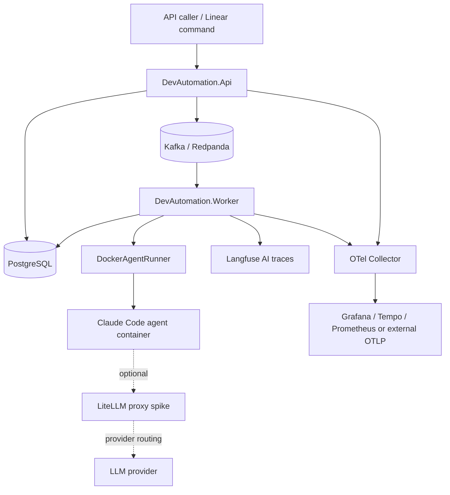
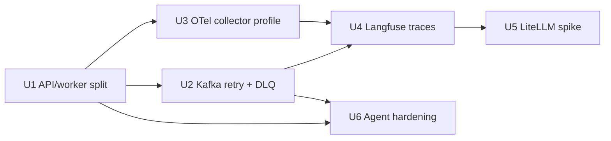

<!-- markdownlint-disable MD013 MD025 MD036 -->

# ReplaceMe Infra Foundation Roadmap - Plan

## Goal Capsule

| Field | Value |
| --- | --- |
| Objective | Build the first operational infrastructure layer for ReplaceMe before expanding AI automation volume. |
| Product authority | User request to turn the infrastructure recommendation into a plan and tickets, grounded in current ReplaceMe code and docs. |
| Execution profile | Standard, cross-cutting infrastructure work split into Linear-sized implementation units. |
| Stop conditions | Stop before full production Kubernetes migration, full LiteLLM adoption, or replacing the current Claude Code agent path without a compatibility proof. |
| Tail ownership | Each U-ID should become a tracked Linear issue in the ReplaceMe project. |

---

## Product Contract

### Summary

ReplaceMe needs a reliable local-to-early-production infrastructure baseline: split API and worker lifecycles, add bounded Kafka retry/DLQ behavior, collect infrastructure telemetry through OpenTelemetry, trace AI runs through Langfuse, evaluate LiteLLM as a gated spike, and harden the agent execution boundary.
The work keeps the current .NET API, PostgreSQL, Redpanda/Kafka, Docker agent runner, Claude Code, Linear, GitHub, and Notion shape intact while making the next infrastructure layer explicit.

### Problem Frame

At roadmap creation, ReplaceMe ran the Minimal API and `KafkaAgentWorker` in the same host. As of 2026-07-13, U1 is merged: `DevAutomation.Api` and `DevAutomation.Worker` now run as separate Compose services with a `migrate` one-shot service applying EF Core migrations first. ReplaceMe still persists tickets and execution logs to PostgreSQL, uses Redpanda as a Kafka-compatible broker, and launches Claude Code in Docker containers through `DockerAgentRunner`.
As of 2026-07-13, U2/U3/U6 are also merged: Kafka processing failures now have bounded retry/DLQ handling, the local compose stack has an optional OTel Collector/Jaeger/Prometheus observability profile, and local Docker socket execution is guarded by readiness plus runner-level production-like checks. The remaining roadmap focus is AI-run observability, LiteLLM compatibility, and follow-up workflow grammar.
Langfuse is the right first AI-observability layer because the product's core questions are run quality, prompt/model cost, latency, failure cause, and approval handoff timing.
LiteLLM is promising as a gateway, but it should remain a spike until Claude Code proxy compatibility, virtual-key delivery, and trace/cost routing are proven.

### Actors

- A1. **ReplaceMe operator.** Runs the local stack, inspects health, and decides whether an agent run is safe.
- A2. **API caller / Linear command surface.** Creates tickets and expects stable queueing behavior.
- A3. **Kafka worker.** Consumes agent jobs and owns retry, DLQ, and terminal failure transitions.
- A4. **Agent runner.** Launches isolated coding agents and streams sanitized execution events.
- A5. **Reviewer / maintainer.** Uses logs, traces, metrics, and PR links to understand what happened.

### Requirements

**Runtime separation**

- R1. API serving and agent-job consumption must be runnable as separate processes or services while sharing the same domain and infrastructure registrations.
- R2. Local Compose must still support a small default stack for development and add optional profiles for worker and observability services.

**Queue reliability**

- R3. Kafka job processing must have bounded retry attempts, durable DLQ handoff, and clear ticket failure state when retries are exhausted.
- R4. Invalid or poison messages must not cause an infinite worker loop or silently disappear without an operator-visible breadcrumb.

**Infrastructure observability**

- R5. OpenTelemetry traces and metrics must flow through an OTLP Collector before they reach local backends or external SaaS targets.
- R6. Observability must be profile-driven and disabled by default in the smallest local run.

**AI observability**

- R7. Agent runs must emit Langfuse traces keyed by ticket/run identity, provider, outcome, duration, approval wait, and PR/MR URL when available.
- R8. Langfuse payloads must use the existing redaction boundary before any prompt, model output, tool input, or environment-derived value leaves the process.
- R9. Langfuse must be optional; disabled mode must not change agent execution behavior.

**LLM gateway evaluation**

- R10. LiteLLM must start as a compatibility spike and optional gateway profile, not as a mandatory replacement for direct Claude Code execution.
- R11. LiteLLM adoption can proceed only after the spike proves Claude Code can route through the proxy and that virtual keys/cost controls work without exposing provider keys to agent containers.

**Agent hardening**

- R12. The plan must reduce production risk around Docker socket access, secret exposure, and agent network scope without breaking the current local developer path.
- R13. Documentation and QA must explain which profiles are local-only, which are safe for shared environments, and which are experimental.

### Acceptance Examples

- AE1. Given only the core profile is enabled, when the operator runs Compose, then API, worker, PostgreSQL, and Redpanda start without requiring Langfuse, LiteLLM, Grafana, or external credentials.
- AE2. Given an agent job repeatedly fails inside worker processing, when retry attempts are exhausted, then the original ticket is marked failed and the final message lands in a configured DLQ topic with the failure reason preserved.
- AE3. Given telemetry is enabled, when a ticket is created and processed, then API and worker traces flow through the OTLP Collector and can be inspected in the configured local backend.
- AE4. Given Langfuse is enabled, when an agent run completes or fails, then one trace exists for that ticket with redacted prompt/output metadata and no raw configured secret value.
- AE5. Given LiteLLM spike mode is enabled, when the compatibility smoke runs, then the result records whether Claude Code honored the proxy and whether the proxy captured cost/routing data.
- AE6. Given production-like environment settings, when Docker socket access is not explicitly allowed, then readiness or startup surfaces a clear block/warning instead of silently running with local-only privileges.

### Scope Boundaries

**In scope**

- Split host/runtime shape for API and worker.
- Kafka retry/DLQ behavior for agent job messages.
- OpenTelemetry Collector and local observability profile.
- Optional Langfuse trace emission for agent runs.
- LiteLLM compatibility spike and optional compose/profile scaffolding.
- Agent execution and secret-handling hardening that supports the current Docker runner.

**Deferred to Follow-Up Work**

- Full Kubernetes/ECS/Fargate runner migration.
- Full LiteLLM production rollout as the default LLM path.
- Multi-tenant billing, user-level quotas, or organization-wide policy enforcement.
- Full Run Passport persistence and rerun lineage beyond the existing v0 summary.
- Replacing existing Linear/Notion/GitHub provider flows.

**Outside this plan**

- Building a new UI dashboard inside ReplaceMe.
- Changing the product identity away from Linear → agent run → GitHub PR → Notion memory.

---

## Planning Contract

### Key Technical Decisions

- KTD1. **Split API and worker before adding more infrastructure.** The worker owns long-running agent execution, retry, and DLQ behavior; separating it prevents API availability from being coupled to job consumption.
- KTD2. **Use OpenTelemetry Collector for infrastructure telemetry.** The app already has OTLP exporter support, so the next stable seam is `app -> collector -> backend`, not direct exporter sprawl.
- KTD3. **Use Langfuse for AI-run traces, not general service telemetry.** OTel remains the infrastructure layer; Langfuse receives LLM/agent-specific trace context, cost, prompt/version, and run-quality metadata.
- KTD4. **Keep Langfuse and LiteLLM disabled by default.** Core local development must stay lightweight and must not require external AI observability or proxy services.
- KTD5. **Gate LiteLLM behind a spike.** LiteLLM's gateway features matter only if Claude Code can reliably route through it and if agent containers can receive scoped virtual keys instead of provider keys.
- KTD6. **Redaction happens before every external observation sink.** Execution logs, OTel attributes, Langfuse events, and LiteLLM-related diagnostics must share the same secret catalog/redaction posture.
- KTD7. **Treat Docker socket execution as local-only until hardened.** The current runner remains useful for local development, but production-like modes need explicit opt-in, readiness warnings, and a migration path toward isolated runners.

### High-Level Technical Design

### Sequencing

1. Separate API and worker runtime first so later infrastructure changes land on the right process boundary.
2. Add queue retry/DLQ before increasing agent throughput.
3. Add OTel collector and local dashboards for service-level visibility.
4. Add Langfuse for AI-run traces once run identity and redaction boundaries are stable.
5. Run the LiteLLM compatibility spike after Langfuse can observe direct execution baseline behavior.
6. Harden the agent boundary in parallel with or immediately after retry/DLQ work.

### Project Tracking and Roadmap

- Notion background: [인프라 아키텍처 아이디에이션](https://app.notion.com/p/39cef22ad4fc81f298fec2e6c87b101d).
- Notion execution plan: [2026-07-13 인프라 로드맵과 티켓 선후관계](https://app.notion.com/p/39cef22ad4fc812c80f4ff18f3e1b643).

| Unit | Issue | Priority | Status | Intent |
| --- | --- | --- | --- | --- |
| U1 | [ZZA-59](https://linear.app/zzanghyunmoo/issue/ZZA-59/api와-worker-런타임-분리) | Medium | Done | API and worker runtime split. |
| U2 | [ZZA-61](https://linear.app/zzanghyunmoo/issue/ZZA-61/kafka-재시도와-dlq-처리-추가) | High | Done | Kafka retry and DLQ behavior. |
| U3 | [ZZA-62](https://linear.app/zzanghyunmoo/issue/ZZA-62/opentelemetry-collector-기반-로컬-관측성-프로필-추가) | Medium | Done | OTel Collector local observability profile. |
| U4 | [ZZA-60](https://linear.app/zzanghyunmoo/issue/ZZA-60/langfuse-ai-실행-trace-연동) | Medium | Ready after U2/U3/U6 | Langfuse AI-run tracing. |
| U5 | [ZZA-63](https://linear.app/zzanghyunmoo/issue/ZZA-63/litellm-proxy-호환성-spike) | Low | Spike after U4 baseline | LiteLLM proxy compatibility spike. |
| U6 | [ZZA-64](https://linear.app/zzanghyunmoo/issue/ZZA-64/agent-실행-격리와-secret-경계-hardening) | High | Done | Agent isolation and secret boundary hardening. |

| Existing issue | Relationship to this plan | Execution guidance |
| --- | --- | --- |
| [ZZA-58](https://linear.app/zzanghyunmoo/issue/ZZA-58/replaceme-net-9-로컬-빌드-경로-정렬) | Historical precondition for U1. | No longer blocking after ZZA-59 merge. |
| [ZZA-52](https://linear.app/zzanghyunmoo/issue/ZZA-52/notion-작업-문서와-패턴-뱅크-설계) | Consumes Run Passport v1 and later Langfuse evidence. | Design plan is done; API/worker split and retry/DLQ are now available, so automation hooks should next focus on idempotency, persistence, and redaction safety. |
| [ZZA-55](https://linear.app/zzanghyunmoo/issue/ZZA-55/github-pr-리뷰-패킷-설계) | Consumes ZZA-52 links and Run Passport v1. | Design plan is done; optionally enrich after ZZA-60. |
| [ZZA-53](https://linear.app/zzanghyunmoo/issue/ZZA-53/linear-이슈-실행-지시서-설계) | Top-level execution workflow. | Start next after the merged infrastructure foundation and ZZA-52/ZZA-55 design contracts. |
| [ZZA-54](https://linear.app/zzanghyunmoo/issue/ZZA-54/provider-doctor와-로컬-안전문-설계) | Mostly covered by ZZA-51 and U6 hardening. | Close as duplicate or redefine only the provider-doctor leftovers not covered by readiness and agent hardening. |

### Assumptions

- Linear project `ReplaceMe` remains the tracking surface for this plan's tickets.
- U1 resolved the runtime split with separate `DevAutomation.Api` and `DevAutomation.Worker` projects and separate Compose service targets.
- Langfuse may be SaaS or self-hosted; ReplaceMe should integrate through environment-configured endpoints and should not share the application PostgreSQL database with Langfuse internals.
- LiteLLM official proxy features such as virtual keys, cost tracking, rate limiting, and gateway routing are relevant only after Claude Code compatibility is proven.

### Sources and Research

- `README.md` for current architecture and supported providers.
- `docker-compose.yml` for current API, worker, migrate, PostgreSQL, Redpanda, and agent-image services.
- `src/DevAutomation.Api/Program.cs` for API hosting, OpenTelemetry wiring, migration-only mode, and health checks.
- `src/DevAutomation.Worker/Program.cs` for worker hosting and worker OpenTelemetry wiring.
- `src/DevAutomation.Infrastructure/Queues/KafkaAgentWorker.cs` for current consume/commit behavior.
- `src/DevAutomation.Infrastructure/Agents/AgentJob.cs` and `src/DevAutomation.Infrastructure/Agents/DockerAgentRunner.cs` for run lifecycle, logs, and Docker execution.
- `src/DevAutomation.Infrastructure/Readiness/SecretCatalog.cs` and `src/DevAutomation.Infrastructure/Agents/SecretRedactor.cs` for current redaction coverage.
- `docs/features/persistence-observability.md`, `docs/features/local-operations.md`, and `docs/features/agent-execution.md` for documented current limits.
- LiteLLM official docs position the proxy as an LLM gateway with virtual keys, auth/logging hooks, cost tracking, and rate limiting.
- Langfuse official docs position it as LLM observability with tracing, prompt/version linking, Docker Compose self-hosting, and Kubernetes Helm deployment for higher-throughput setups.

### System-Wide Impact

- API availability has improved for U1 because long-running agent work no longer shares the same host lifecycle.
- Operational debugging shifts from DB/file-log-only inspection to traces, metrics, DLQ messages, and Langfuse AI traces.
- Agent-run privacy risk increases if observability sinks receive raw prompts or outputs, so redaction and attribute allowlists become part of every telemetry unit.
- Compose grows optional profiles; documentation must keep the default path small enough for daily local use.

### Risks and Mitigations

- **Risk:** Langfuse traces may capture sensitive repo or ticket content. **Mitigation:** redact first, store only allowlisted metadata by default, and require explicit opt-in for raw prompt/output capture.
- **Risk:** Kafka retry can duplicate work if ticket state is not idempotent. **Mitigation:** gate worker execution on current ticket status and write tests for duplicate message handling.
- **Risk:** LiteLLM may not be compatible with Claude Code CLI routing. **Mitigation:** keep it as a spike with an adoption gate, not a production dependency.
- **Risk:** OTel and Langfuse overlap can create confusing double instrumentation. **Mitigation:** keep OTel for service/runtime telemetry and Langfuse for AI-run traces.
- **Risk:** Docker socket hardening can break local development. **Mitigation:** keep the local profile explicit and add production-like warnings before restricting the default developer path.

---

## Implementation Units

### U1. Split API and worker runtime

- **Status:** Done on 2026-07-13 in PR #14.
- **Goal:** Run HTTP API serving and Kafka agent consumption as separate process roles.
- **Requirements:** R1, R2, AE1.
- **Dependencies:** None.
- **Files:** `src/DevAutomation.Api/Program.cs`, `src/DevAutomation.Worker/DevAutomation.Worker.csproj`, `src/DevAutomation.Worker/Program.cs`, `src/DevAutomation.Infrastructure/DependencyInjection/ServiceCollectionExtensions.cs`, `DevAutomation.sln`, `Dockerfile`, `docker-compose.yml`, `.env.example`, `tests/DevAutomation.Tests/HostingCompositionTests.cs`, `docs/features/local-operations.md`, `docs/features/agent-execution.md`.
- **Approach:** Extract shared service registration so API and worker can compose the same core/infrastructure services without always registering `KafkaAgentWorker` in the API host. Prefer a new worker project for clarity; if a single binary is retained, add an explicit role option and prove API-only mode does not consume Kafka.
- **Patterns to follow:** Existing `AddDevAutomationCore`, `AddDevAutomationInfrastructure`, `KafkaAgentWorker`, and `docker-compose.yml` service style.
- **Test scenarios:**
  - API host composition registers endpoints and health checks but does not register `KafkaAgentWorker` when running in API mode.
  - Worker host composition registers `KafkaAgentWorker`, `AgentJob`, queue options, and infrastructure services without mapping HTTP endpoints.
  - Compose default or documented core profile starts `api`, `worker`, `postgres`, and `kafka` with the worker connected to the same network and environment surface.
  - Misconfigured role value fails fast or falls back to a documented safe default without silently running both roles.
- **Verification:** `dotnet build` and `dotnet test` pass; local Compose can start API and worker separately and `/health` still verifies DB, Kafka, and Docker from the API service.

### U2. Add Kafka retry and DLQ behavior

- **Goal:** Make agent job failures bounded, observable, and recoverable instead of relying on reconnect loops or immediate terminal failure only.
- **Requirements:** R3, R4, AE2.
- **Dependencies:** U1.
- **Files:** `src/DevAutomation.Core/Options/QueueOptions.cs`, `src/DevAutomation.Infrastructure/Queues/AgentQueueMessage.cs`, `src/DevAutomation.Infrastructure/Queues/KafkaAgentWorker.cs`, `src/DevAutomation.Infrastructure/Queues/KafkaTicketQueue.cs`, `src/DevAutomation.Infrastructure/Agents/AgentJob.cs`, `src/DevAutomation.Infrastructure/Telemetry/DevAutomationTelemetry.cs`, `src/DevAutomation.Api/appsettings.json`, `.env.example`, `tests/DevAutomation.Tests/AgentQueueMessageTests.cs`, `tests/DevAutomation.Tests/KafkaAgentWorkerRetryTests.cs`, `docs/features/agent-execution.md`, `docs/features/local-operations.md`, `docs/qa/03-agent-execution.md`.
- **Approach:** Extend the queue message contract with attempt metadata or use Kafka headers consistently, add configurable `MaxAttempts` and `DlqTopic`, and publish exhausted messages to DLQ with sanitized failure context. Commit offsets only after the retry/DLQ decision is durable. Keep ticket state idempotent so duplicate messages do not launch multiple containers for terminal tickets.
- **Patterns to follow:** Existing `AgentQueueMessage` JSON contract, manual commit pattern in `KafkaAgentWorker`, and ticket state transitions in `AgentJob`.
- **Test scenarios:**
  - Valid message that fails below `MaxAttempts` is requeued with incremented attempt metadata and does not commit until the requeue publish succeeds.
  - Message that reaches `MaxAttempts` is published to the DLQ topic and the related ticket records a clear failed state when a ticket exists.
  - Invalid JSON or missing ticket id is routed to the DLQ or logged with an operator-visible breadcrumb according to the final contract.
  - Duplicate message for a `Completed`, `Failed`, or `Cancelled` ticket is acknowledged without starting a new container.
  - DLQ failure does not cause silent loss; the worker logs the publish failure and leaves the offset uncommitted or follows the documented fallback.
- **Verification:** Unit tests cover message metadata, retry decisions, DLQ decisions, and terminal ticket idempotency; a local Redpanda smoke can show a failed job ending in the configured DLQ topic.

### U3. Add OpenTelemetry collector and local observability profile

- **Goal:** Turn the existing OpenTelemetry hooks into an inspectable local observability stack.
- **Requirements:** R5, R6, AE3.
- **Dependencies:** U1.
- **Files:** `docker-compose.yml`, `docker/otel-collector-config.yaml`, `docker/prometheus.yml`, `src/DevAutomation.Api/appsettings.json`, `.env.example`, `docs/features/persistence-observability.md`, `docs/features/local-operations.md`, `docs/qa/06-persistence-observability.md`, `README.md`.
- **Approach:** Add an `observability` Compose profile with an OTLP Collector and lightweight local backends such as Prometheus plus Tempo/Jaeger and Grafana. Configure API and worker OTLP endpoints through environment variables only when the profile is enabled. Keep Serilog file logs unchanged for the default path.
- **Execution note:** This is mostly configuration; prefer runtime smoke verification over unit tests.
- **Patterns to follow:** Existing `TelemetryOptions`, `Program.cs` OpenTelemetry exporter wiring, and profile-based `agent-image` service in Compose.
- **Test scenarios:**
  - Core Compose path works with `DEVAUTOMATION_Telemetry__Enabled=false` and does not require collector services.
  - Observability profile starts the collector and local backends on documented ports.
  - API and worker export traces/metrics to the collector when enabled.
  - Collector or backend outage does not crash API/worker startup when telemetry is optional.
- **Verification:** Local operator can create a ticket or hit `/health`, then see service traces or metrics in the configured backend through the observability profile.

### U4. Integrate Langfuse AI-run tracing

- **Goal:** Capture AI-run-level observability without exposing raw secrets or making Langfuse mandatory.
- **Requirements:** R7, R8, R9, AE4.
- **Dependencies:** U2, U3.
- **Files:** `src/DevAutomation.Core/Options/LangfuseOptions.cs`, `src/DevAutomation.Infrastructure/Telemetry/IAgentTraceSink.cs`, `src/DevAutomation.Infrastructure/Telemetry/LangfuseAgentTraceSink.cs`, `src/DevAutomation.Infrastructure/Telemetry/NoOpAgentTraceSink.cs`, `src/DevAutomation.Infrastructure/Agents/AgentJob.cs`, `src/DevAutomation.Infrastructure/Agents/DockerAgentRunner.cs`, `src/DevAutomation.Infrastructure/Agents/ClaudeStreamParser.cs`, `src/DevAutomation.Infrastructure/Readiness/SecretCatalog.cs`, `src/DevAutomation.Infrastructure/DependencyInjection/ServiceCollectionExtensions.cs`, `src/DevAutomation.Api/appsettings.json`, `.env.example`, `tests/DevAutomation.Tests/LangfuseAgentTraceSinkTests.cs`, `tests/DevAutomation.Tests/SecretRedactorTests.cs`, `docs/features/persistence-observability.md`, `docs/qa/06-persistence-observability.md`.
- **Approach:** Add an optional trace sink abstraction that receives sanitized agent lifecycle events from `AgentJob` and parsed stream-json events from `DockerAgentRunner`. The Langfuse implementation should build one trace per ticket/run with spans or events for queue start, container start, approval waits, agent output summary, completion/failure, and PR/MR URL. Raw prompt/output capture should be opt-in and redacted before submission.
- **Patterns to follow:** Existing `DevAutomationTelemetry` counters, `ClaudeStreamParser`, `SecretCatalog`, and `SecretRedactor` registration.
- **Test scenarios:**
  - Langfuse disabled uses `NoOpAgentTraceSink` and does not create HTTP clients or outbound calls during an agent run.
  - Langfuse enabled sends ticket id, status, duration, provider, and PR/MR URL metadata for a completed run.
  - Failed run sends failure reason after redaction and records terminal outcome.
  - Prompt/output payload containing configured Anthropic, GitHub, Linear, Notion, or database secrets is redacted before the sink serializes the payload.
  - Langfuse API failure is surfaced as telemetry/log warning and does not change ticket terminal status.
- **Verification:** Unit tests prove redaction and disabled-mode behavior; a configured Langfuse endpoint shows one trace per smoke ticket with no raw secret values.

### U5. Run LiteLLM proxy compatibility spike

- **Goal:** Decide whether LiteLLM should become the LLM gateway for ReplaceMe agent runs.
- **Requirements:** R10, R11, AE5.
- **Dependencies:** U4.
- **Files:** `docs/spikes/litellm-claude-code-proxy.md`, `docker/litellm/config.yaml`, `docker-compose.yml`, `src/DevAutomation.Core/Options/CodingAgentOptions.cs`, `src/DevAutomation.Infrastructure/CodingAgents/ClaudeCodeCodingAgentIntegration.cs`, `.env.example`, `docs/features/agent-execution.md`, `docs/qa/03-agent-execution.md`.
- **Approach:** Add an optional `llm-gateway` profile and spike doc that tests whether Claude Code can route through a LiteLLM-compatible endpoint while preserving approval MCP behavior and stream-json parsing. Record whether virtual keys, rate limits, cost tracking, and Langfuse/OTel correlation are available in the intended execution path. Do not make LiteLLM required for normal runs until the spike produces an adopt decision.
- **Execution note:** Treat this as a spike with a written decision record; implementation should prefer smoke evidence over broad code changes.
- **Patterns to follow:** Existing `CodingAgentOptions`, `ClaudeCodeCodingAgentIntegration.BuildRunScript`, and Docker agent image environment injection.
- **Test scenarios:**
  - Direct Claude Code path still works when the LiteLLM profile is disabled.
  - Spike path starts LiteLLM with a local config and injects only the intended proxy/virtual-key environment into the agent container.
  - Claude Code smoke either proves proxy routing through observable LiteLLM request records or records a clear incompatibility with evidence.
  - Approval MCP remains configured and usable during the proxy smoke.
  - Spike output explicitly decides adopt, hold, or reject for LiteLLM as default gateway.
- **Verification:** `docs/spikes/litellm-claude-code-proxy.md` contains the smoke result, compatibility verdict, security notes, and follow-up adoption requirements.

### U6. Harden agent execution and secret boundaries

- **Goal:** Make local-only privileges explicit and prevent observability/gateway work from widening the secret or Docker-socket risk surface.
- **Requirements:** R12, R13, AE6.
- **Dependencies:** U1, U2.
- **Files:** `src/DevAutomation.Core/Options/AgentOptions.cs`, `src/DevAutomation.Infrastructure/Agents/DockerAgentRunner.cs`, `src/DevAutomation.Infrastructure/Readiness/Checks/DockerReadinessCheck.cs`, `src/DevAutomation.Infrastructure/Readiness/SecretCatalog.cs`, `src/DevAutomation.Infrastructure/Agents/SecretRedactor.cs`, `.env.example`, `docker-compose.yml`, `tests/DevAutomation.Tests/ProfileReadinessTests.cs`, `tests/DevAutomation.Tests/SecretRedactorTests.cs`, `docs/features/agent-execution.md`, `docs/features/readiness-profile.md`, `docs/qa/01-readiness-profile.md`.
- **Approach:** Add explicit options for local Docker-socket execution posture, agent network policy expectations, and allowed secret propagation. Readiness should warn or block when a production-like environment uses local-only Docker socket mode without opt-in. Expand secret catalog coverage for new Langfuse and LiteLLM keys and ensure every new sink uses the shared redactor.
- **Patterns to follow:** Existing readiness check model, `SecretRedactionReadinessCheck`, and `DockerAgentRunner` environment construction.
- **Test scenarios:**
  - Local development mode allows Docker socket execution with a documented warning level.
  - Production-like mode without explicit local-runner opt-in blocks or reports a required readiness failure.
  - Langfuse and LiteLLM secret values are included in `SecretCatalog` and covered by `SecretRedactor`.
  - Agent environment contains only the selected provider/gateway secrets and does not pass unused provider keys.
  - Documentation distinguishes local, observability, AI-observability, and gateway profiles.
- **Verification:** Readiness tests cover local and production-like posture; redaction tests include Langfuse/LiteLLM secrets; docs make the local-only Docker socket risk visible.

---

## Verification Contract

| Gate | Applies to | Done signal |
| --- | --- | --- |
| `dotnet restore DevAutomation.sln` | All units | Dependencies restore without errors. |
| `dotnet build DevAutomation.sln` | All code units | API, worker, infrastructure, and tests compile. |
| `dotnet test DevAutomation.sln` | U1, U2, U4, U6 | Unit and composition tests pass. |
| Core Compose smoke | U1, U2 | `api`, `worker`, `postgres`, and `kafka` start; `/health` returns dependency status. |
| Observability profile smoke | U3 | Collector/backend profile starts and receives API/worker telemetry. |
| Langfuse smoke | U4 | Configured Langfuse target shows one redacted trace per test ticket. |
| LiteLLM spike smoke | U5 | Spike doc records proxy compatibility evidence and verdict. |
| Readiness hardening smoke | U6 | Production-like unsafe Docker socket posture is reported or blocked as designed. |

---

## Definition of Done

- Product scope remains the infrastructure foundation described here; no unit silently turns LiteLLM into the default gateway before U5's verdict.
- API and worker can run as separate process roles.
- Kafka retry and DLQ behavior is tested and documented.
- OTel Collector profile works without making observability mandatory in core local development.
- Langfuse traces are optional, redacted, and correlated to ticket/run identity.
- LiteLLM has a recorded compatibility verdict before any adoption ticket is opened.
- Agent execution hardening covers Docker socket posture and new AI-observability/gateway secrets.
- Relevant feature docs and QA runbooks are updated for every new profile or operational mode.
- Experimental spike code or abandoned attempts are removed unless intentionally preserved under `docs/spikes/` as evidence.

<!-- markdownlint-enable MD013 MD025 MD036 -->
