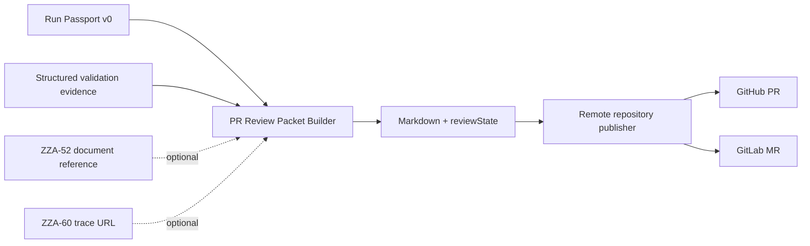

# GitHub PR Review Packet - Plan

<!-- markdownlint-disable MD013 MD025 MD036 -->

## Goal Capsule

| Field | Value |
| --- | --- |
| Objective | Design the first implementation-ready PR review packet contract for ReplaceMe so agent-created GitHub PRs carry consistent review context, validation evidence, Run Passport links, and later Notion/Langfuse backlinks. |
| Product authority | Linear ZZA-55, "GitHub PR 리뷰 패킷 설계", grounded in the existing ReplaceMe repo and Run Passport v0 contract. |
| Execution profile | Design ticket; do not implement the generator in this slice. |
| Stop conditions | Stop before building Notion lifecycle documents, Langfuse traces, full evidence persistence, rerun lineage, or provider-specific PR/MR API rewrites beyond the interface needed by this design. |
| Tail ownership | A later implementation ticket owns generator code, tests, provider adapter changes, and rollout. |

---

## Product Contract

### Summary

ReplaceMe already creates a branch and a GitHub PR or GitLab MR at the end of an agent run, but the current change-request body is only a one-line automation note. Reviewers need a repeatable packet that explains the problem, summarizes the change, lists validation evidence, calls out missing evidence and residual risk, and links back to the execution record. ZZA-55 defines that packet as a provider-neutral Markdown contract with a GitHub-first publication path.

The packet must consume [`Run Passport v0`](../features/run-passport.md) as the canonical run identity and link shape. It must also reserve fields for the ZZA-52 Notion lifecycle document and later Langfuse trace links without designing those systems here.

### Problem Frame

The existing workspace PR/MR body convention is a Korean four-section body: problem, change, test, demo. ReplaceMe should preserve that convention while adding run-review metadata in stable fields. Without one packet contract, downstream work will drift: Notion pages may use one field name for run links, GitHub PRs another, and GitLab MRs a third. Reviewers would also be unable to tell whether a PR is ready or draft when test evidence is missing.

### Actors

- A1. **Agent run worker.** Produces or triggers a PR/MR after code changes are committed.
- A2. **Review packet builder.** Later converts Run Passport and available evidence into a Markdown packet and readiness decision.
- A3. **GitHub reviewer.** Reads the PR body and decides what to review first.
- A4. **Notion lifecycle document worker.** ZZA-52-owned surface that stores or returns lifecycle document links and may backlink to the PR.
- A5. **Operator / maintainer.** Uses missing-evidence and residual-risk fields to decide whether to approve, rerun, or request manual work.

### Requirements

**Template and language**

- R1. The PR body must keep the Korean four-section convention: `문제`, `변경`, `테스트`, `데모 / 리뷰 포인트`.
- R2. The packet must include stable metadata fields inside that body rather than relying on free-form prose.
- R3. The packet must be renderable as plain Markdown in GitHub PRs and GitLab MRs.

**Run and backlink fields**

- R4. The packet must include `runPassportId`, `runPassportUrl`, `runPassportContractVersion`, `ticketId`, `ticketTitle`, `issueTracker`, `externalIssueKey`, and `externalIssueUrl` from Run Passport v0.
- R5. The packet must include nullable Notion backlink fields named `notionDocumentId` and `notionDocumentUrl`, sourced only from the ZZA-52 interface when available.
- R6. The packet must reserve a nullable `langfuseTraceUrl` field for ZZA-60 or a later AI-observability integration.
- R7. The packet must not duplicate the ZZA-52 Notion page schema or lifecycle-state design. It only requires ZZA-52 to expose a ticket/run-scoped document reference.

**Evidence and missing evidence**

- R8. The packet must show validation commands, results, and concise output summaries when available.
- R9. The packet must show missing evidence explicitly as `미확인`, `해당 없음`, `실패`, or `비공개` with a reason and owner, instead of omitting the field.
- R10. The packet must not infer passed tests, demo availability, Notion links, Langfuse links, or residual-risk clearance from raw logs unless a later evidence collector provides a structured value.
- R11. The packet must avoid raw execution logs, secrets, token values, local filesystem paths, and unredacted prompt/output payloads.

**Draft versus ready**

- R12. The packet builder must produce a `reviewState` of `ready` or `draft` with machine-readable reasons.
- R13. A packet is `ready` only when the Run Passport status is `Completed`, the packet has either passing validation evidence or an explicit no-test exception, and residual risk is known.
- R14. A packet is `draft` when critical evidence is missing, validation failed or was not run, residual risk is unknown, the run is not completed, or required run identity fields are unavailable.
- R15. Provider publication must honor the decision: GitHub uses draft PRs where possible; GitLab uses MR draft semantics where supported or a visible `Draft:` title prefix fallback.

**Provider boundary**

- R16. Packet Markdown generation must be provider-neutral.
- R17. GitHub publication is the primary ZZA-55 target; GitLab remains a supported remote-repository provider boundary and must not be broken by GitHub-only assumptions.
- R18. Provider adapters own only publication mechanics: create/update body, draft flag or title prefix, and resulting PR/MR URL.

### Acceptance Examples

- AE1. Given a completed Run Passport with a Linear URL, validation command output, residual-risk summary, and a Notion document reference, when the packet is built, then the GitHub PR body has the four Korean sections, the Run Passport link, the Linear link, the Notion link, validation evidence, and `reviewState=ready`.
- AE2. Given a completed Run Passport but no validation evidence and no explicit no-test exception, when the packet is built, then the body shows missing test evidence and the publication decision is `draft`.
- AE3. Given `notionDocumentUrl=null`, when the packet is built, then the Notion row says `미확인 - ZZA-52 lifecycle document reference unavailable` and does not invent a Notion URL.
- AE4. Given the configured remote repository provider is GitLab, when the same packet is published, then the Markdown body is reused and only MR-specific draft/body mechanics differ.
- AE5. Given a failed or cancelled Run Passport, when packet generation is requested, then it either does not create a review PR or creates a clearly draft diagnostic packet according to the implementation ticket's trigger policy; it must not mark the packet ready.

### Scope Boundaries

**In scope for this design**

- PR/MR review packet Markdown contract.
- Missing-evidence behavior and vocabulary.
- Draft-versus-ready decision rules.
- Run Passport, Notion, and Langfuse link fields.
- GitHub-first publication boundary with GitLab-compatible abstractions.
- Implementation units, test scenarios, and validation commands for a later code ticket.

**Out of scope**

- Implementing the generator in this design-only slice.
- ZZA-52 Notion lifecycle page schema, templates, state transitions, or pattern-bank design.
- Langfuse trace emission or cost/quality observability.
- Full Run Passport persistence, rerun lineage, or evidence database design.
- Changing Linear issue execution grammar.
- Pushing branches, opening real GitHub PRs, or modifying external systems from this worktree.

---

## Review Packet Contract

### Contract version

The first packet contract version should be:

```text
pr-review-packet/v0
```

The packet contract version is independent from Run Passport's `run-passport-summary/v0`. The PR body should show both values so reviewers can identify which renderer and which run-summary shape were used.

### Input model

A later implementation should introduce a small Core contract similar to this shape:

```csharp
public sealed record PrReviewPacketInput(
    RunPassportSummaryResponse RunPassport,
    IReadOnlyList<ValidationEvidence> ValidationEvidence,
    string? ChangeSummary,
    string? DemoNotes,
    string? ResidualRiskSummary,
    string? NotionDocumentId,
    string? NotionDocumentUrl,
    string? LangfuseTraceUrl,
    ExplicitNoTestException? NoTestException);
```

Notes:

- `RunPassport` is required and is the only source for run identity and issue/PR fields.
- `NotionDocumentId` and `NotionDocumentUrl` are copied from ZZA-52's document-reference interface if present. This plan does not define Notion pages.
- `LangfuseTraceUrl` stays nullable until the Langfuse integration exists.
- `ValidationEvidence` must be structured. Do not parse arbitrary logs into pass/fail claims in the packet builder.
- `ExplicitNoTestException` must include a short reason and source, such as `docs-only change` or `design-only plan`.

### Output model

A later implementation should return both Markdown and publication metadata:

```csharp
public sealed record PrReviewPacket(
    string ContractVersion,
    string MarkdownBody,
    ReviewState ReviewState,
    IReadOnlyList<string> ReviewStateReasons,
    IReadOnlyList<MissingEvidence> MissingEvidence);

public enum ReviewState
{
    Ready,
    Draft
}
```

`ReviewStateReasons` are for automation and provider adapters. The Markdown body must also include human-readable reasons.

### Missing-evidence vocabulary

Use this vocabulary consistently in packet output:

| Status | Use when | Rendered Korean label |
| --- | --- | --- |
| `present` | Structured value exists and is safe to show. | `확인됨` |
| `missing` | The value is expected but unavailable. | `미확인` |
| `not_applicable` | A structured source explicitly says it does not apply. | `해당 없음` |
| `failed` | Validation exists and failed. | `실패` |
| `redacted` | A value exists but cannot be shown safely. | `비공개` |

Missing-evidence entries should include:

- `field`: stable field name, for example `validationEvidence`, `notionDocumentUrl`, or `residualRiskSummary`.
- `status`: one of the statuses above.
- `reason`: short reviewer-readable reason.
- `owner`: source ticket or system, for example `ZZA-52`, `ZZA-60`, `agent validation`, or `manual operator`.
- `blocksReady`: whether this missing value forces `reviewState=draft`.

### Draft versus ready decision table

| Condition | Review state impact | Reason code |
| --- | --- | --- |
| Run Passport missing, wrong contract version, or missing `runPassportId`/`runPassportUrl` | Draft/block | `run-passport-required` |
| Run Passport status is not `Completed` | Draft/block | `run-not-completed` |
| Validation evidence has a failed command | Draft/block | `validation-failed` |
| Validation evidence is absent and no explicit no-test exception exists | Draft/block | `validation-missing` |
| Residual risk summary is absent | Draft/block | `risk-summary-missing` |
| Notion document link is absent | Non-blocking for v0 | `notion-link-missing` |
| Langfuse trace link is absent | Non-blocking for v0 | `langfuse-link-missing` |
| External issue URL is absent | Ready allowed if ticket has no external issue | `external-issue-missing` |
| All blocking conditions pass | Ready | `ready` |

Notion and Langfuse links are intentionally non-blocking in v0 because their owners are separate follow-up tickets. They must still render as missing evidence so reviewers understand the gap.

### Markdown body template

The rendered body should preserve the existing Korean four-section convention exactly at the top level:

```markdown
## 문제
- 원본 이슈: {externalIssueKeyOrTicketId} ({externalIssueUrlOrMissing})
- 티켓: {ticketTitle}
- Run Passport: {runPassportId} ({runPassportUrl})
- Notion 작업 문서: {notionDocumentUrlOrMissing}
- Langfuse trace: {langfuseTraceUrlOrMissing}
- 배경: {problemSummaryOrRunSummary}

## 변경
- 요약: {changeSummaryOrMissing}
- PR/MR: {pullRequestUrlOrCurrentChangeRequest}
- Packet contract: `pr-review-packet/v0`
- Run Passport contract: `{runPassportContractVersion}`

## 테스트
| 상태 | 명령/항목 | 결과 요약 |
| --- | --- | --- |
| {확인됨/실패/미확인/해당 없음} | {commandOrField} | {summaryOrReason} |

## 데모 / 리뷰 포인트
- 리뷰 상태: `{readyOrDraft}`
- 상태 사유: {reviewStateReasons}
- 잔여 리스크: {residualRiskSummaryOrMissing}
- 누락 evidence:
  - {field}: {label} - {reason} (owner: {owner})
- 리뷰어 우선 확인 포인트: {reviewFocusOrMissing}
```

Rendering rules:

- Preserve the four `##` headings even when sections are sparse.
- Use relative API URLs from Run Passport as-is; do not convert them to absolute local machine paths.
- Use `미확인` rows instead of blank values.
- Keep each test output summary concise and redacted. Link to richer evidence only when a safe external evidence URL exists.
- If `pullRequestUrl` is unavailable before publication, render `생성 중` or update the body after publication if the adapter supports it.

### ZZA-52 Notion dependency interface

ZZA-55 depends on ZZA-52 only for a document reference, not for Notion template details. The needed interface is:

```csharp
public sealed record LifecycleDocumentReference(
    Guid TicketId,
    string RunPassportId,
    string? NotionDocumentId,
    string? NotionDocumentUrl,
    DateTimeOffset? UpdatedAt);
```

ZZA-52 may implement this through any storage or provider-specific mechanism. ZZA-55 should consume it as an optional reference and should not know Notion page properties, databases, page blocks, or pattern-bank structure. If the reference is unavailable, the packet renders missing evidence and remains draft/ready according to the non-blocking v0 rule.

---

## Technical Design

### Current code seams

Current relevant files:

- `src/DevAutomation.Core/Contracts/RunPassportContracts.cs` exposes Run Passport v0.
- `src/DevAutomation.Infrastructure/RemoteRepositories/IRemoteRepositoryIntegration.cs` abstracts provider-specific change-request creation.
- `src/DevAutomation.Infrastructure/RemoteRepositories/GitHubRemoteRepositoryIntegration.cs` creates GitHub PRs with `gh pr create` and a one-line body.
- `src/DevAutomation.Infrastructure/RemoteRepositories/GitLabRemoteRepositoryIntegration.cs` creates GitLab MRs through the GitLab API and a one-line description.
- `src/DevAutomation.Infrastructure/Agents/DockerAgentRunner.cs` executes the agent, commits changes, runs the provider script, and extracts `PR_URL=`.

### Proposed component split



Responsibilities:

- **Packet builder:** pure function/service that produces Markdown, missing-evidence entries, and readiness decision.
- **Evidence source:** later component that supplies structured validation results. It may start with agent-provided implementation summaries, but it must not scrape raw logs in the builder.
- **Provider publisher:** applies the same Markdown to GitHub or GitLab and maps `reviewState` to provider-specific draft mechanics.
- **Run Passport endpoint:** remains the canonical read API for ticket/run identity.

### Provider publication boundary

The existing `IRemoteRepositoryIntegration.BuildCreateChangeRequestScript()` returns a shell script without packet input. The implementation ticket should replace or extend this with a provider-neutral request model such as:

```csharp
public sealed record ChangeRequestPublication(
    string Title,
    string BodyMarkdown,
    ReviewState ReviewState,
    string SourceBranch,
    string TargetBranch);
```

Provider rules:

- GitHub: use `gh pr create --body-file <packet-file>` and add `--draft` when `ReviewState=Draft`.
- GitHub update path: if the PR URL is needed inside the body, create first, then `gh pr edit --body-file <packet-file>` after `PR_URL` is known, or render `생성 중` in v0.
- GitLab: use the MR API `description` field for the same Markdown. If draft API behavior is not available in the configured GitLab version, prefix the title with `Draft:` for draft packets.
- Do not put provider-specific syntax into the packet builder.
- Do not require Notion or Langfuse credentials for PR/MR creation.

### Security and redaction

- Reuse existing redaction boundaries before packet rendering.
- Never include raw Docker logs, environment variables, approval payloads, secret assignments, or local filesystem paths.
- Validation summaries should be short and safe, for example `dotnet test DevAutomation.sln --no-restore passed` rather than full stdout.
- External URLs may be included only for product surfaces: Run Passport relative URL, Linear/Jira issue URL, GitHub/GitLab PR/MR URL, Notion document URL, and Langfuse trace URL.

---

## Implementation Units

### U1. Add packet contract and pure renderer

**Goal:** Build a pure packet renderer that can be unit-tested without GitHub, GitLab, Notion, or Docker.

**Requirements:** R1-R14.

**Files:**

- Create `src/DevAutomation.Core/Contracts/PrReviewPacketContracts.cs`
- Create `src/DevAutomation.Core/Services/PrReviewPacketBuilder.cs` or equivalent Core service
- Create `tests/DevAutomation.Tests/PrReviewPacketBuilderTests.cs`
- Update `docs/features/run-passport.md` only if a cross-reference to the packet consumer is desired

**Approach:**

- Define `PrReviewPacketInput`, `ValidationEvidence`, `MissingEvidence`, `PrReviewPacket`, and `ReviewState`.
- Render the exact four-section Markdown template.
- Implement missing-evidence normalization.
- Implement the draft/ready decision table.
- Keep Notion and Langfuse fields nullable and non-blocking in v0.

**Test scenarios:**

- Ready packet with completed Run Passport, passing validation, known risk, and optional Notion link.
- Draft packet when validation evidence is absent.
- Draft packet when validation failed.
- Draft packet when Run Passport status is not completed.
- Notion missing renders `미확인` but does not block ready by itself.
- Markdown does not include local path-looking strings or known secret assignment patterns.

**Verification:**

```bash
dotnet test DevAutomation.sln --no-restore --filter PrReviewPacketBuilderTests
git diff --check
```

### U2. Add provider publication request model

**Goal:** Let GitHub/GitLab providers receive Markdown body and review state without moving packet logic into shell scripts.

**Requirements:** R15-R18.

**Files:**

- Modify `src/DevAutomation.Infrastructure/RemoteRepositories/IRemoteRepositoryIntegration.cs`
- Modify `src/DevAutomation.Infrastructure/RemoteRepositories/GitHubRemoteRepositoryIntegration.cs`
- Modify `src/DevAutomation.Infrastructure/RemoteRepositories/GitLabRemoteRepositoryIntegration.cs`
- Modify `src/DevAutomation.Infrastructure/Agents/DockerAgentRunner.cs`
- Add provider-focused tests where current abstractions allow string/script assertions

**Approach:**

- Introduce a provider-neutral publication request with `BodyMarkdown` and `ReviewState`.
- Write the packet to a temp file in the agent container, not as an inline shell argument.
- GitHub uses `--body-file` and `--draft` for draft packets.
- GitLab uses `description` and provider-supported draft behavior or `Draft:` prefix fallback.
- Keep `PR_URL=` extraction behavior stable so `Ticket.PrUrl` and Run Passport continue to work.

**Test scenarios:**

- GitHub script includes `--body-file` and `--draft` for draft packets.
- GitHub script omits `--draft` for ready packets.
- GitLab request uses `description` populated from packet Markdown.
- Existing GitHub/GitLab token environment handling remains unchanged.

**Verification:**

```bash
dotnet test DevAutomation.sln --no-restore --filter RemoteRepository
dotnet build DevAutomation.sln --no-restore
git diff --check
```

### U3. Wire packet inputs into the agent completion flow

**Goal:** Generate the packet at change-request creation time using Run Passport v0 and the best available structured evidence.

**Requirements:** R4-R14.

**Files:**

- Modify `src/DevAutomation.Infrastructure/Agents/AgentJob.cs`
- Modify `src/DevAutomation.Infrastructure/Agents/DockerAgentRunner.cs`
- Add a small evidence DTO or service only if structured evidence is available without broad persistence changes
- Update `docs/features/agent-execution.md`
- Update `README.md` API or behavior notes only if externally visible behavior changes

**Approach:**

- Build Run Passport summary from the ticket when the run reaches PR/MR creation.
- Feed any structured validation summary produced by the agent implementation path into the packet builder. If none exists, render missing evidence and create a draft packet.
- Use ZZA-52 document reference only through the optional interface defined above. If ZZA-52 is not implemented, pass nulls.
- Do not add full evidence persistence in this unit.

**Test scenarios:**

- Completed run with evidence creates ready publication request.
- Completed run without evidence creates draft publication request.
- Failed/cancelled run does not create a ready publication request.
- Null Notion/Langfuse references do not crash packet generation.

**Verification:**

```bash
dotnet test DevAutomation.sln --no-restore --filter PrReviewPacket
dotnet build DevAutomation.sln --no-restore
git diff --check
```

### U4. Document operator/reviewer behavior

**Goal:** Make reviewers understand the packet states and missing-evidence rules.

**Requirements:** R1-R18.

**Files:**

- Create `docs/features/pr-review-packet.md`
- Update `docs/features/feature-status.md`
- Update `docs/README.md`
- Update `docs/qa/03-agent-execution.md` with a manual PR/MR body checklist

**Approach:**

- Document the four-section template.
- Document `ready` versus `draft` conditions.
- Document missing evidence labels.
- Document Run Passport, Notion, and Langfuse field ownership.
- Document GitHub/GitLab publication boundaries.

**Verification:**

```bash
git diff --check
```

---

## Dependencies and Sequencing

1. **Already available:** Run Passport v0 contract from [`2026-07-09-001-feat-run-passport-minimal-contract-plan.md`](./2026-07-09-001-feat-run-passport-minimal-contract-plan.md) and [`../features/run-passport.md`](../features/run-passport.md).
2. **Required interface from ZZA-52:** optional lifecycle document reference with `ticketId`, `runPassportId`, `notionDocumentId`, and `notionDocumentUrl`. ZZA-55 must not design or persist Notion pages itself.
3. **Optional future enrichment from ZZA-60:** `langfuseTraceUrl` or equivalent trace reference.
4. Implement U1 before provider publication changes so body and state rules are stable.
5. Implement U2 before U3 if the current provider shell scripts need to receive the packet body safely.
6. U4 follows U1-U3 so docs match the final code behavior.

## Verification Contract for the Future Implementation

Minimum commands before returning the implementation ticket:

```bash
dotnet test DevAutomation.sln --no-restore --filter PrReviewPacket
dotnet build DevAutomation.sln --no-restore
git diff --check
```

If `--no-restore` fails because packages are not restored, run `dotnet restore DevAutomation.sln` once, rerun the commands, and record the deviation.

## Definition of Done

- The packet renderer outputs the exact four-section Korean template.
- The renderer includes Run Passport v0 fields and nullable Notion/Langfuse fields.
- Missing evidence is explicit and uses the agreed vocabulary.
- Draft/ready state is deterministic and test-covered.
- GitHub publication can create draft or ready PRs with the packet body.
- GitLab publication either supports the same semantics or documents its fallback without breaking MR creation.
- No external PR, Notion page, Linear issue, or Langfuse trace is modified by tests.

## Implementation-Time Unknowns

- Whether the current agent path can produce structured validation evidence without adding persistence. If not, initial generated packets should default to draft unless an explicit no-test exception is provided.
- Whether GitLab draft behavior should use an API field or title prefix for the configured GitLab version. Keep this inside the GitLab adapter.
- Whether the PR URL should be included in the initial body or patched after creation. GitHub can support a post-create edit; v0 may render `생성 중` to avoid a second API call.

## Risks

- **False confidence:** A ready packet without real validation would mislead reviewers. Mitigate by making missing validation evidence block ready.
- **Scope creep into Notion:** ZZA-55 only needs Notion document references. ZZA-52 owns page design, lifecycle states, and pattern-bank details.
- **Provider drift:** GitHub and GitLab should share Markdown generation. Keep provider differences in adapters only.
- **Sensitive evidence leakage:** Packet summaries must be allowlisted and redacted, never raw logs or secret-bearing output.
