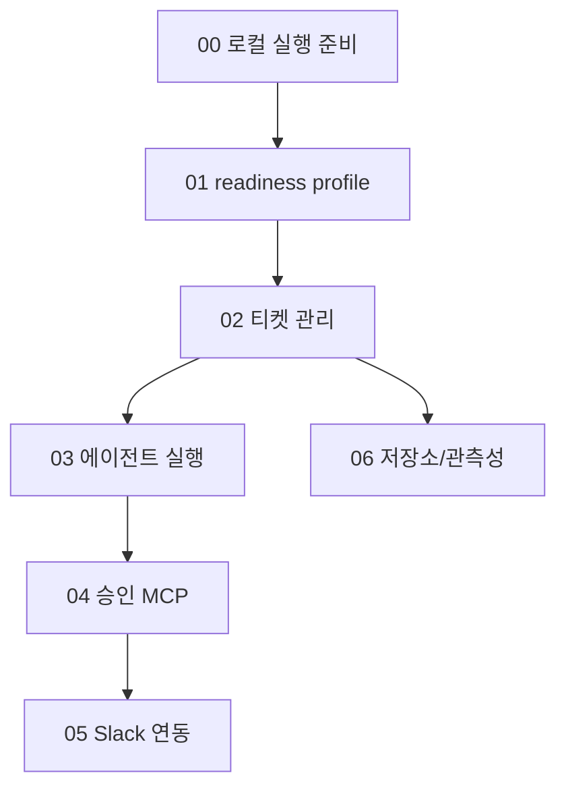

# QA 실 테스트 문서

<!-- markdownlint-disable MD013 -->

이 폴더는 ReplaceMe를 직접 실행해 기능별로 확인하기 위한 QA 문서입니다.
기능 설명 문서가 “무엇을 하는가”를 설명한다면, QA 문서는 “내 로컬에서 어떻게
확인하는가”에 집중합니다.

> **안전 경계:** 현재 API는 인증/인가가 없고 host Docker socket을 사용합니다.
> trusted single-user local 환경과 disposable QA target에서만 실행합니다.

`/health` 200은 worker, agent image, 외부 provider가 모두 준비됐다는 뜻이 아닙니다.
`docker compose down`은 현재 비영속 Redpanda의 queue, DLQ, consumer offset을 잃을
수 있습니다.

## 추천 테스트 순서



처음에는 외부 credential 없이 가능한 **L1/L2 테스트**부터 실행하고, GitHub,
Linear, Notion, Anthropic, Slack credential이 준비되면 **L3/L4 테스트**로 확장합니다.

## 테스트 레벨

| 레벨 | 목적 | 외부 credential 필요 여부 | 대표 확인 |
| --- | --- | --- | --- |
| L0 | 빌드/단위 테스트 | 없음 | `dotnet build`, `dotnet test` |
| L1 | 로컬 인프라 실행 | 없음 | `docker compose up`, `/health` |
| L2 | API 기본 동작 | 대부분 없음 | 티켓 생성/조회, readiness failure 확인 |
| L3 | 외부 provider 연동 | 필요 | GitHub/Linear/Notion/Slack 실제 호출 |
| L4 | 전체 agent run | 필요 | agent가 branch/PR을 만들고 티켓 완료 |

## 문서 목록

| 문서 | 확인 기능 | 먼저 필요한 것 |
| --- | --- | --- |
| [`00-local-runbook.md`](./00-local-runbook.md) | 로컬 실행, `/health`, build/test | Docker |
| [`01-readiness-profile.md`](./01-readiness-profile.md) | `personal-github-linear-notion` readiness profile | Docker, 선택적으로 GitHub/Linear/Notion credential |
| [`02-ticket-management.md`](./02-ticket-management.md) | 티켓 생성/조회/취소/문서 생성 API | API 실행 |
| [`03-agent-execution.md`](./03-agent-execution.md) | Kafka worker, Docker agent, PR/MR 생성 | agent image, Anthropic, GitHub/GitLab token |
| [`04-approval-flow.md`](./04-approval-flow.md) | Approval MCP, 수동 승인/거절 API | pending approval 또는 full agent run |
| [`05-slack-integration.md`](./05-slack-integration.md) | Slack 알림, interactivity 서명 검증 | Slack App credential |
| [`06-persistence-observability.md`](./06-persistence-observability.md) | PostgreSQL 저장, 실행 로그, redaction, 파일 로그 | API 실행 |

## 공통 준비

```bash
cd /path/to/ReplaceMe
cp .env.example .env
export BASE_URL=http://localhost:8080
```

처음 smoke test에서는 `.env`를 다음처럼 두면 외부 연동 없이 기본 API를 확인하기
쉽습니다.

```env
DEVAUTOMATION_Notifier__Provider=None
DEVAUTOMATION_IssueTracker__Provider=None
DEVAUTOMATION_DocumentTool__Provider=None
DEVAUTOMATION_ProfileReadiness__SelectedProfile=
```

provider 연동을 확인할 때만 GitHub, Linear, Notion, Slack 값을 채웁니다. 실제 token은
절대 문서나 git diff에 남기지 않습니다.

## 공통 실행

```bash
docker compose --profile build-only build agent-image
docker compose up --build api worker postgres kafka
```

다른 터미널에서 테스트 명령을 실행합니다.

```bash
curl -s "$BASE_URL/health" | jq .
```

`jq`가 없으면 `| jq .` 부분을 빼고 응답 JSON을 직접 읽어도 됩니다.

## 결과 기록 템플릿

QA를 돌릴 때 아래 양식으로 PR comment나 Linear comment에 기록하면 됩니다.

```markdown
## QA 결과

- 날짜:
- 브랜치/커밋:
- 환경: macOS / Docker Desktop / .NET SDK 버전
- 실행 범위: L1/L2/L3/L4

| 케이스 | 결과 | 메모 |
| --- | --- | --- |
| LOCAL-001 | Pass/Fail |  |
| READY-001 | Pass/Fail |  |

## 발견한 이슈

- 없음 / 또는 이슈 목록
```

## 정리/초기화

```bash
# DB와 queue/DLQ/consumer offset을 유지하는 일시 정지/재개
docker compose stop
docker compose start

# 컨테이너 제거. PostgreSQL volume은 남지만 현재 Redpanda state는 유실될 수 있습니다.
docker compose down

# PostgreSQL까지 삭제합니다. disposable QA에서만 사용합니다.
docker compose down -v
```

로그를 지우기 전 incident evidence가 필요한지 확인하고 실행 중 container를 먼저
중지합니다. `rm -rf logs/*`는 disposable local log에만 사용합니다.

<!-- markdownlint-enable MD013 -->
